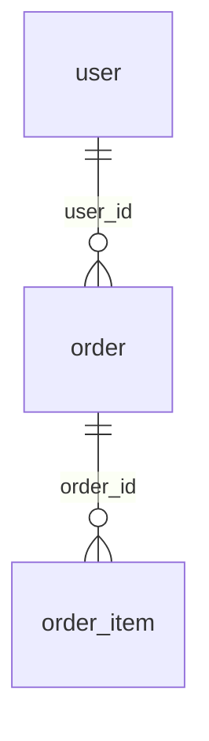
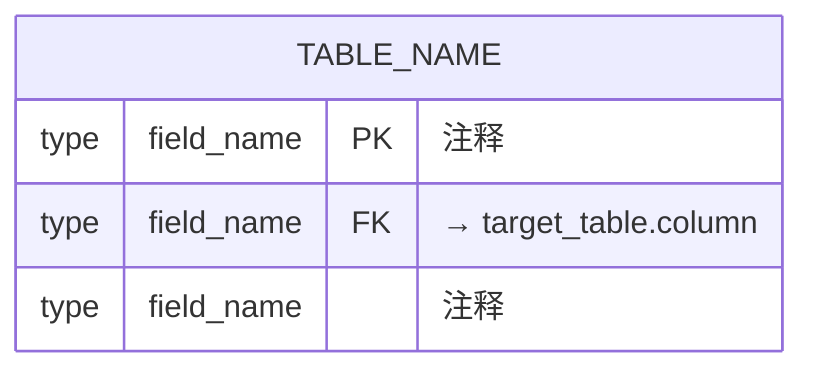
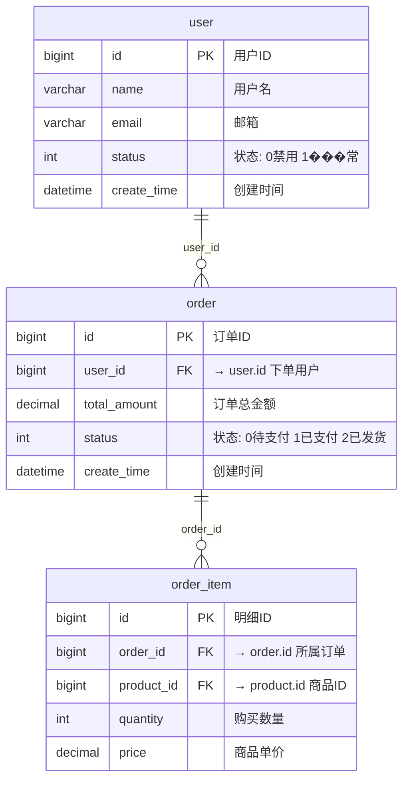
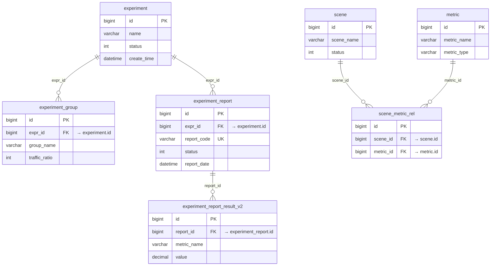
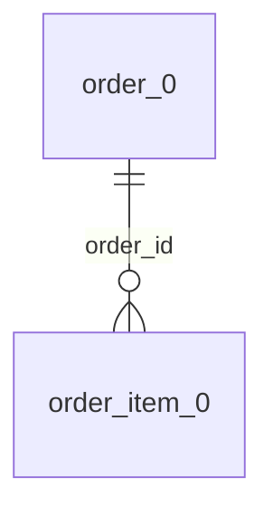

# ER 图生成指南

## 一、表信息提取

### 1.1 实体提取（JPA + MyBatis-Plus）

```
# 查找所有实体类（@Entity / @Table / @TableName）
Grep(pattern="@(Entity|Table|TableName)", glob="*.java", path="src/main/java/", output_mode="content", -A=1)

# 提取表名值
Grep(pattern="@(Table|TableName)\\(.*name\\s*=", glob="*.java", path="src/main/java/", output_mode="content")

# 查找字段注解
Grep(pattern="@Column", glob="*.java", path="src/main/java/", output_mode="content", -A=3)
```

### 1.2 表信息结构

```yaml
table:
  name: "user"
  comment: "用户主表，存储平台注册用户信息"
  module: "用户模块"
  fields:
    - name: "id"
      type: "bigint"
      pk: true
    - name: "dept_id"
      type: "bigint"
      fk: true
      ref: "department.id"
```

## 二、关系识别

### 2.1 JPA 关系注解

| 注解 | Mermaid 符号 | 说明 |
|------|-------------|------|
| @OneToOne | `\|\|--\|\|` | 一对一 |
| @OneToMany | `\|\|--o{` | 一对多 |
| @ManyToOne | `}o--\|\|` | 多对一 |
| @ManyToMany | `}o--o{` | 多对多 |

### 2.2 外键字段推断

```java
private Long userId;      // → user 表的外键
private Long orderId;     // → order 表的外键
private Long parentId;    // → 自关联

@JoinColumn(name = "user_id", referencedColumnName = "id")
```

### 2.3 关系标签规范

**必须使用 FK 列名作为关系标签**：



**标签推断规则**：

| 规则 | FK 列名模式 | 生成的标签 |
|------|-----------|-----------|
| 标准外键 | `{table}_id` | 直接使用列名 |
| 前缀命名 | `expr_id` → experiment | 使用 `expr_id` |
| JOIN 条件 | `a.id = b.foreign_id` | 使用 `foreign_id` |

## 三、Mermaid ER 图格式

### 3.1 基础结构



### 3.2 字段类型映射

| Java/MySQL 类型 | Mermaid 类型 |
|----------------|-------------|
| Long, BigInt | bigint |
| Integer, Int | int |
| String, Varchar | varchar |
| Boolean, Tinyint | tinyint |
| BigDecimal, Decimal | decimal |
| Date, DateTime, LocalDateTime | datetime |

### 3.3 关系符号说明

| 符号 | 含义 | 示例场景 |
|------|------|---------|
| `\|\|--\|\|` | 一对一（两端必须） | 用户-用户详情 |
| `\|\|--o\|` | 一对一（右端可选） | 用户-头像 |
| `\|\|--o{` | 一对多 | 订单-订单项 |
| `}o--\|\|` | 多对一 | 订单项-商品 |
| `}o--o{` | 多对多 | 用户-角色（通过中间表） |

### 3.4 完整示例



### 3.5 大型 ER 图完整示例



## 四、质量检查清单

- [ ] 每个表有业务注释（`%% 表名: 描述`）
- [ ] 主键字段标记 `PK`
- [ ] 外键字段标记 `FK "→ target.column"`
- [ ] 关系标签使用 FK 列名（非泛化词）
- [ ] 关系方向正确（一的一方在左边）
- [ ] 表较多时按业务模块分组

## 五、常见问题

### 分表处理



### 多数据源

```mermaid
erDiagram
    %% ========== 主库 (master) ==========
    user { ... }

    %% ========== 从库 (slave) ==========
    log { ... }
```

### 表太多

1. 按业务模块分多个 ER 图
2. 只展示核心表和关系
3. 使用折叠或分层展示

---

# 调用链追踪模式

## 一、三层追踪架构

```
Controller → Service → Repository → Database
     ↓           ↓           ↓
  RequestDTO  BusinessLogic  Entity
```

## 二、Controller 层追踪

### Service 依赖定位

```java
// 模式 1: 字段注入
@Autowired
private UserService userService;

// 模式 2: 构造器注入
public UserController(UserService userService) {
    this.userService = userService;
}

// 模式 3: Lombok
@RequiredArgsConstructor
public class UserController {
    private final UserService userService;
}
```

## 三、Service 层追踪

### 接口 vs 实现

```
# 从接口��实现
Grep(pattern="implements UserService", glob="*.java", path="src/main/java/", output_mode="content")
```

### 多 Service 协作追踪

```
UserService.createUser()
    ├── UserRepository.save()              → t_user
    ├── RoleService.bindRoles()
    │       └── UserRoleRepository.batchInsert()  → t_user_role
    └── AuditService.log()
            └── AuditLogRepository.save()  → t_audit_log
```

## 四、Repository 层追踪

### JPA Repository

```java
public interface UserRepository extends JpaRepository<User, Long> {
    List<User> findByStatus(Integer status);        // SELECT FROM t_user WHERE status = ?

    @Query("SELECT u FROM User u WHERE u.deptId = :deptId")
    List<User> findByDept(@Param("deptId") Long deptId);
}
```

### MyBatis Mapper

```java
@Mapper
public interface UserMapper {
    User selectById(Long id);
    int insert(User user);
    int updateById(User user);
}
```

对应 XML：

```xml
<mapper namespace="cn.caijiajia.user.mapper.UserMapper">
    <select id="selectById" resultType="User">
        SELECT * FROM t_user WHERE id = #{id}
    </select>

    <insert id="insert">
        INSERT INTO t_user (name, email) VALUES (#{name}, #{email})
    </insert>
</mapper>
```

### 表操作识别

| 操作 | JPA 方法 | MyBatis 标签 | SQL 类型 |
|------|---------|-------------|---------|
| 查询 | findBy* | `<select>` | SELECT |
| 新增 | save (新对象) | `<insert>` | INSERT |
| 更新 | save (有ID) | `<update>` | UPDATE |
| 删除 | delete* | `<delete>` | DELETE |

## 五、复杂场景

### 事务方法

```java
@Transactional
public void transferMoney(Long fromId, Long toId, BigDecimal amount) {
    accountRepository.deduct(fromId, amount);      // t_account UPDATE
    accountRepository.add(toId, amount);           // t_account UPDATE
    transferLogRepository.save(log);               // t_transfer_log INSERT
}
```

### 动态 SQL

```xml
<select id="search" resultType="User">
    SELECT * FROM t_user
    <where>
        <if test="name != null">AND name LIKE #{name}</if>
        <if test="status != null">AND status = #{status}</if>
    </where>
</select>
```

### 多数据源

```java
@DS("slave")
public User getUser(Long id) {
    return userRepository.findById(id);
}
```

## 六、调用链报告模板

```markdown
## GET /api/order/{id}

### 基本信息
- **Controller**: OrderController.getOrder
- **Service**: OrderServiceImpl.getOrderById
- **事务**: 无

### 调用链
OrderController.getOrder(id)
    └── OrderService.getOrderById(id)
        ├── OrderRepository.findById(id)
        │       └── t_order [SELECT]
        └── OrderItemRepository.findByOrderId(id)
                └── t_order_item [SELECT]

### 涉及表
| 表名 | 操作 | SQL 类型 | 说明 |
|------|------|---------|------|
| t_order | 查询 | SELECT | 订单主表 |
| t_order_item | 查询 | SELECT | 订单明细 |

### 表关系
t_order 1--* t_order_item : order_id
```
