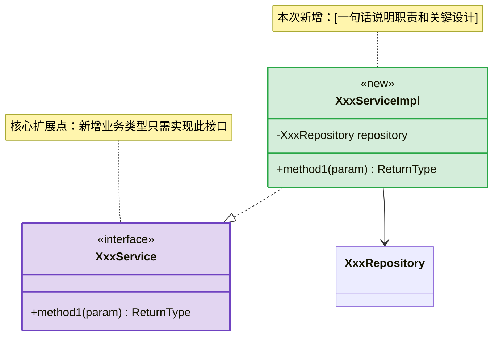

# 技术设计文档模板（上）：概述 ~ 接口设计

## 使用说明

本模板用于中大型功能的技术设计，包含架构、接口、数据、事务等完整设计内容。

> 本文件包含模板的概述、架构设计、接口设计部分。数据设计及后续章节见 [templates-tech-design-part2.md](templates-tech-design-part2.md)。

> ⚠️ 所有章节必须遵循上方「文档表达原则」：一句话先行、结构可视化、表格优于段落、粗体做路标。

---

# [功能名称] 技术设计文档

## 文档信息

| 项目 | 内容 |
|------|------|
| 文档版本 | v1.0 |
| 创建日期 | YYYY-MM-DD |
| 作者 | [姓名] |
| 状态 | 草稿 / 评审中 / 已定稿 |
| JIRA | [JIRA 编号] |

---

<!-- 文档超过 300 行时，在此插入一级标题目录 -->

---

## 快速熟悉（N 分钟读完）

### 一句话概括

[功能名称] 通过 **[核心机制/模式]**（[关键组件]）实现 [核心目标]，生命周期：[阶段1] → [阶段2] → [阶段3]。

### 变更全景

> **先看这里**：本次设计改了什么，一目了然。带着这张表再看后续架构和细节。

| 标记 | 组件 | 类型 | 说明 |
|------|------|------|------|
| 🟢 新增 | [NewClassA] | Service | [一句话职责] |
| 🟢 新增 | [new_table_a] | 数据表 | [一句话说明] |
| 🔵 变更 | [ExistingClassB] | Service | [具体改了什么] |
| 🔴 删除 | [OldClassC] | Service | [删除原因] |
| 🟣 核心 | [IXxxService] | 接口 | 扩展点，新增实现类即可扩展 |
| 🟠 外部 | [外部系统名] | 外部依赖 | [调用方式] |
| ⚪ 不变 | [ExistingClassD] | — | 仅做依赖关系参考 |

### 关键设计决策

1. **[决策1]**：选择 [X] 而非 [Y]，因为 [原因]
2. **[决策2]**：[一句话描述]

> 涉及方案选型的决策，**必须附对比论证表**（避免评审时反复追问"为什么不用 XX"）：

| 方案 | 优势 | 劣势 | 结论 |
|------|------|------|------|
| [方案A] | [优势] | [劣势] | **✅ 采纳**，因为 [核心原因] |
| [方案B] | [优势] | [劣势] | ❌ 不采纳，因为 [核心原因] |

### 分类速查

> 仅当系统存在多类型/多档次时使用，否则跳过。

| 分类 | 触发方式 | 包含类型 | 一句话描述 |
|------|---------|---------|-----------|
| [分类1] | [方式] | [类型列表] | [一句话] |
| [分类2] | [方式] | [类型列表] | [一句话] |

### [可选] 与现有方案对比

> 当系统已有类似实现（如对标项目、前一版方案）时使用，说清"哪些复用、哪些不同"。

| 维度 | [现有方案/对标项目] | 本方案 |
|------|-------|--------|
| [维度1] | [做法] | [做法] |
| [维度2] | [做法] | [做法] |
| 复用清单 | — | [列出可复用的类/配置/表] |

### 核心架构

> 侧重**流程/交互视角**，与正文 2.1 的结构视角互补，禁止同图两处。

```
[触发源]（[触发方式列表]）
    ↓
[核心调度类]（调度中心）
├── [方法1]()    ← [触发场景1]
└── [方法2]()    ← [触发场景2]
        ↓
[路由/工厂]([参数]) — 策略路由
        ↓
    ┌─────────────────────────────────┐
    │ N 个 [接口] 实现               │
    │                                 │
    │ [分类1]（M 种）：               │
    │   [类型] → [外部系统]           │
    │                                 │
    │ [分类2]（K 种）：               │
    │   [类型] → [处理方式]           │
    └─────────────────────────────────┘
```

### 全景速览

| 维度 | 概要 |
|------|------|
| 涉及模块 | [模块A]、[模块B]、[模块C] |
| 新增/变更接口 | N 个 |
| 新增/变更表 | M 张 |
| 外部依赖 | [系统1]、[系统2] |
| 核心技术选型 | [选型1]、[选型2] |

---

## 1. 概述

### 1.1 背景

> **一句话**：[用一句话说清业务背景和需求来源]

[补充细节（如有）]

### 1.2 目标

| # | 目标 | 衡量指标 |
|---|------|---------|
| 1 | [目标1] | [指标] |
| 2 | [目标2] | [指标] |

### 1.3 范围

| 维度 | 内容 |
|------|------|
| **包含** | [功能点列表] |
| **不包含** | [排除项列表] |

### 1.4 名词解释

| 术语 | 定义 |
|------|------|
| [术语] | [定义] |

---

## 2. 架构设计

### 2.1 整体架构

```
┌─────────────────────────────────────────────────────────────┐
│                        API Gateway                           │
└─────────────────────────────┬───────────────────────────────┘
                              │
┌─────────────────────────────▼───────────────────────────────┐
│                      Controller Layer                        │
│  ┌─────────────────┐  ┌─────────────────┐                   │
│  │ XxxController   │  │ YyyController   │                   │
│  └─────────────────┘  └─────────────────┘                   │
└─────────────────────────────┬───────────────────────────────┘
                              │
┌─────────────────────────────▼───────────────────────────────┐
│                       Service Layer                          │
│  ┌─────────────────┐  ┌─────────────────┐                   │
│  │ XxxService      │  │ YyyService      │                   │
│  └─────────────────┘  └─────────────────┘                   │
└─────────────────────────────┬───────────────────────────────┘
                              │
┌───────────────────��─────────▼───────────────────────────────┐
│                     Repository Layer                         │
│  ┌─────────────────┐  ┌─────────────────┐                   │
│  │ XxxRepository   │  │ YyyRepository   │                   │
│  └─────────────────┘  └─────────────────┘                   │
└─────────────────────────────┬───────────────────────────────┘
                              │
┌─────────────────────────────▼───────────────────────────────┐
│                        Database                              │
└────────────────────────────────────────────��────────────────┘
```

### 2.2 类图

> 读者已通过「变更全景」知道新增/变更了哪些组件，此图**可视化验证**类间关系。颜色与变更全景对应。



| 样式 | 含义 |
|------|------|
| 🟢 绿色 | 新增 |
| 🔵 蓝色 | 变更 |
| 🟣 紫色 | 核心/扩展点 |
| 🟠 橙色 | 外部系统 |
| 默认 | 已有/不变 |

### 2.3 模块划分

| 模块 | 职责 | 主要类 | 变更状态 |
|------|------|--------|---------|
| [模块 1] | [职责描述] | XxxController, XxxService | 🟢新增 / 🔵变更 / 🔴删除 / ⚪不变 |

### 2.4 依赖关系

```
Module A ──→ Module B ──→ Module C
               ↓
            Module D
```

### 2.5 技术选型

| 技术 | 选型 | 原因 |
|------|------|------|
| 框架 | Spring Boot 2.x | 公司标准 |
| ORM | MyBatis | 公司标准 |
| 缓存 | Redis | 高性能 |
| 消息 | RabbitMQ | 解耦 |

---

## 3. 接口设计

### 3.0 通用约定

> **本节声明一次，后续接口详情不再重复。**

| 项目 | 约定 |
|------|------|
| 认证方式 | Header `Authorization: Bearer {token}`，除白名单接口外均需携带 |
| Content-Type | `application/json; charset=UTF-8` |
| 响应包装 | 统一 `{"code": 0, "message": "success", "data": {...}}` |
| 时间格式 | `yyyy-MM-dd HH:mm:ss`（入参/出参一致） |
| 金额精度 | `BigDecimal`，统一 `decimal(18,2)` |
| 分页 | 入参：`pageNum`（从1开始）/ `pageSize`（默认20，上限100）；出参：`total` / `pages` / `list` |

**通用错误码**（接口详情中不再重复列出）：

| code | 含义 | 触发场景 |
|------|------|---------|
| 0 | 成功 | — |
| 400 | 参数校验失败 | 字段缺失/格式错误/超出约束 |
| 401 | 未认证 | Token 缺失或过期 |
| 403 | 无权限 | 角色不匹配 |
| 500 | 系统异常 | 未捕获异常，返回"系统繁忙" |

> 以上为默认值，项目实际约定不同时直接覆盖。

### 3.1 接口清单

> 变更标记：🟢 新增 · 🔵 修改 · 🔴 删除 · 无标记=已有不变

| # | 方法 | 路径 | 描述 | 权限 | 变更 |
|---|------|------|------|------|------|
| 1 | POST | /api/xxx | 创建 XXX | 登录 | 🟢 新增 |
| 2 | GET | /api/xxx/{id} | 查询 XXX | 登录 | 🟢 新增 |
| 3 | PUT | /api/xxx/{id} | 更新 XXX | 登录 | 🟢 新增 |
| 4 | DELETE | /api/xxx/{id} | 删除 XXX | 管理员 | 🟢 新增 |

### 3.2 接口详情

> **格式规范**：参数用表格定义（类型、约束、说明），示例用纯 JSON（只放真实值，不带注释）。两者分离，互不混淆。

#### 3.2.1 POST /api/xxx — 创建 XXX

**请求参数**：

| 参数 | 类型 | 必填 | 约束 | 说明 |
|------|------|:----:|------|------|
| name | String | 是 | max=50, 唯一 | 名称 |
| type | String | 是 | 枚举: `A` / `B` / `C` | 类型 |
| amount | BigDecimal | 否 | ≥0, 默认 0 | 金额 |
| remark | String | 否 | max=200 | 备注 |

**响应字段**（`data` 内）：

| 字段 | 类型 | 说明 |
|------|------|------|
| id | Long | 主键 |
| name | String | 名称 |
| type | String | 类型 |
| status | String | 状态: `ACTIVE` / `INACTIVE` |
| createdAt | String | 创建时间 |

**请求示例**：

```json
{
  "name": "测试",
  "type": "A",
  "amount": 99.90
}
```

**响应示例**：

```json
{
  "code": 0,
  "message": "success",
  "data": {
    "id": 1,
    "name": "测试",
    "type": "A",
    "status": "ACTIVE",
    "createdAt": "2024-01-15 10:30:00"
  }
}
```

**业务错误码**（仅列出本接口特有的）：

| code | 描述 | 处理建议 |
|------|------|---------|
| 1001 | 名称已存在 | 更换名称后重试 |

### 3.3 参数映射表

> **涉及外部系统对接时必须提供**，明确每个字段的值来源和去向，减少联调阶段的沟通成本。

| 字段 | 值/来源 | 去向 | 说明 |
|------|---------|------|------|
| [字段A] | [来自哪个接口/表/配置] | [传给哪个接口/写入哪张表] | [转换逻辑，如有] |
| [字段B] | 常量 `"XXX"` | [去向] | — |
| [字段C] | `[表名].[字段名]` | [外部系统接口] | 需做 [格式转换说明] |
