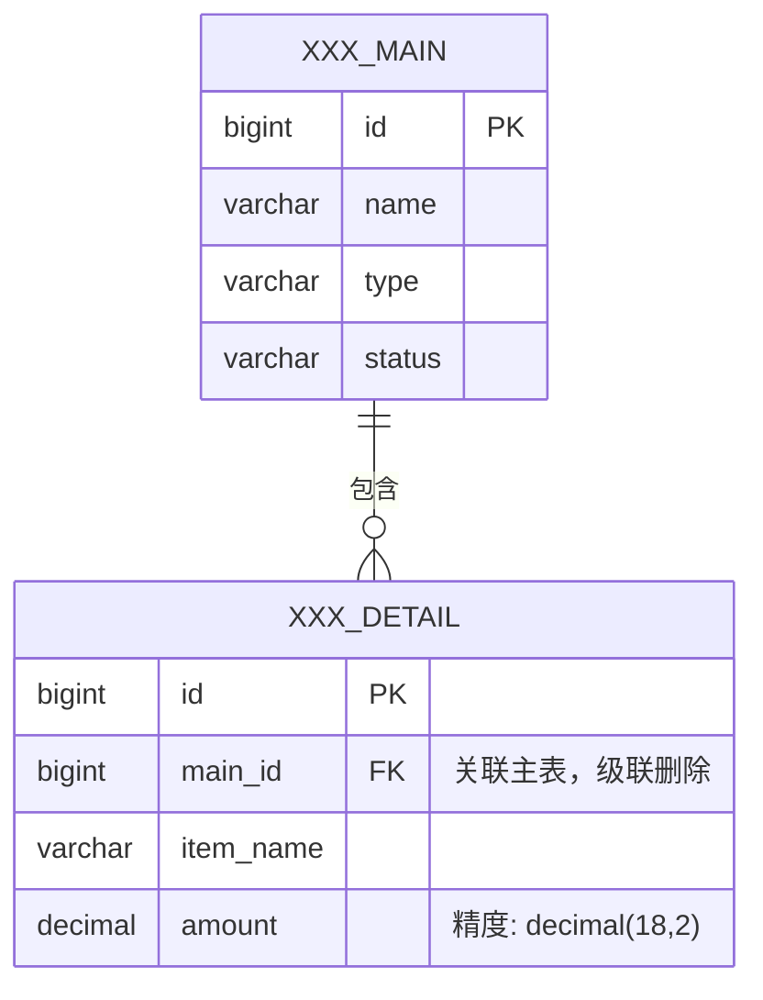

# 技术设计文档模板（下）：数据设计 ~ 附录

> 本文件包含技术设计文档模板的数据设计、业务逻辑、事务、非功能、错误处理、测试、代码质量、风险、附录部分。
> 概述、架构、接口部分见 [templates-tech-design-part1.md](templates-tech-design-part1.md)。

---

## 4. 数据设计

### 4.1 实体关系图

> 展示数据表之间的关联关系（由 cc-diagram 生成）



> 以下 ASCII 图为备用格式（cc-diagram 不可用时降级使用）

```
┌─────────────────┐       ┌─────────────────┐
│     xxx_main    │ 1───n │   xxx_detail    │
├─────────────────┤       ├─────────────────┤
│ id              │       │ id              │
│ name            │       │ main_id      ───┼──┐
│ type            │       │ item_name       │  │
│ status          │       │ amount          │  │
│ created_at      │       │ created_at      │  │
│ updated_at      │       │ updated_at      │  │
└─────────────────┘       └─────────────────┘  │
        │                                       │
        └───────────────────────────────────────┘
```

### 4.2 表结构设计

#### 4.2.1 xxx_main 表

**描述**: XXX 主表

| 字段 | 类型 | 约束 | 默认值 | 说明 |
|------|------|------|--------|------|
| id | bigint(20) | PK, AUTO_INCREMENT | - | 主键 |
| name | varchar(50) | NOT NULL, UNIQUE | - | 名称 |
| type | varchar(20) | NOT NULL | - | 类型：A/B/C |
| status | varchar(20) | NOT NULL | 'ACTIVE' | 状态：ACTIVE/INACTIVE |
| amount | decimal(10,2) | NOT NULL | 0.00 | 金额 |
| remark | varchar(200) | NULL | NULL | 备注 |
| created_by | bigint(20) | NOT NULL | - | 创建人ID |
| created_at | datetime | NOT NULL | CURRENT_TIMESTAMP | 创建时间 |
| updated_by | bigint(20) | NULL | NULL | 更新人ID |
| updated_at | datetime | NULL | NULL ON UPDATE CURRENT_TIMESTAMP | 更新时间 |
| deleted | tinyint(1) | NOT NULL | 0 | 删除标记 |

**索引**:
| 索引名 | 字段 | 类型 | 说明 |
|--------|------|------|------|
| PRIMARY | id | 主键 | - |
| uk_name | name | 唯一 | 名称唯一 |
| idx_type_status | type, status | 普通 | 类型+状态查询 |
| idx_created_at | created_at | 普通 | 时间范围查询 |

**DDL**:
```sql
CREATE TABLE `xxx_main` (
  `id` bigint(20) NOT NULL AUTO_INCREMENT COMMENT '主键',
  `name` varchar(50) NOT NULL COMMENT '名称',
  `type` varchar(20) NOT NULL COMMENT '类型：A/B/C',
  `status` varchar(20) NOT NULL DEFAULT 'ACTIVE' COMMENT '状态：ACTIVE/INACTIVE',
  `amount` decimal(10,2) NOT NULL DEFAULT '0.00' COMMENT '金额',
  `remark` varchar(200) DEFAULT NULL COMMENT '备注',
  `created_by` bigint(20) NOT NULL COMMENT '创建人ID',
  `created_at` datetime NOT NULL DEFAULT CURRENT_TIMESTAMP COMMENT '创建时间',
  `updated_by` bigint(20) DEFAULT NULL COMMENT '更新人ID',
  `updated_at` datetime DEFAULT NULL ON UPDATE CURRENT_TIMESTAMP COMMENT '更新时间',
  `deleted` tinyint(1) NOT NULL DEFAULT '0' COMMENT '删除标记',
  PRIMARY KEY (`id`),
  UNIQUE KEY `uk_name` (`name`),
  KEY `idx_type_status` (`type`, `status`),
  KEY `idx_created_at` (`created_at`)
) ENGINE=InnoDB DEFAULT CHARSET=utf8mb4 COMMENT='XXX主表';
```

### 4.3 常量与枚举定义

> **设计阶段就确定常量和枚举**，避免编码时产生魔法值。

| 名称 | 类型 | 值域 | 说明 |
|------|------|------|------|
| `XxxStatusEnum` | 枚举 | ACTIVE(1)/INACTIVE(2)/DELETED(3) | xxx 状态 |
| `XxxTypeEnum` | 枚举 | TYPE_A(1)/TYPE_B(2) | xxx 类型 |
| `MAX_RETRY_COUNT` | 常量 | 3 | 最大重试次数 |
| `BATCH_SIZE` | 常量 | 500 | 批量操作分批大小 |

> 规则：有限枚举集 → 枚举类（带 code + name + fromCode()）；配置类数值 → 常量类；多处使用 → `constants/` 包

---

## 5. 业务逻辑设计

### 5.1 核心流程

#### 5.1.1 创建流程

```
请求接入 → 参数校验 → 唯一性检查 → 数据持久化（事务） → 后置处理 → 返回结果
```

### 5.2 业务规则

| # | 规则 | 描述 | 触发时机 |
|---|------|------|---------|
| 1 | 名称唯一 | 同一租户下名称不能重复 | 创建、更新 |
| 2 | 状态流转 | ACTIVE → INACTIVE（单向） | 更新状态 |
| 3 | 删除限制 | 有关联数据时不能删除 | 删除 |

---

## 6. 事务设计

### 6.1 事务边界

| 操作 | 事务范围 | 隔离级别 | 说明 |
|------|---------|---------|------|
| 创建 | main + detail | REPEATABLE_READ | 保证一致性 |
| 更新 | main | READ_COMMITTED | 单表更新 |
| 删除 | main + detail | REPEATABLE_READ | 级联删除 |

### 6.2 并发控制

| 场景 | 方案 | 实现 |
|------|------|------|
| 并发创建同名 | 唯一索引 | 数据库唯一约束 |
| 并发更新 | 乐观锁 | version 字段 |

---

## 7. 非功能设计

### 7.1 性能要求

| 指标 | 要求 | 说明 |
|------|------|------|
| 响应时间 | < 200ms | P99 |
| 吞吐量 | > 100 TPS | 峰值 |
| 数据量 | 支持 1000万 | 单表 |

### 7.2 缓存设计

| 缓存项 | Key 格式 | 过期时间 | 更新策略 |
|--------|---------|---------|---------|
| 详情 | xxx:{id} | 30min | 更新时删除 |
| 列表 | xxx:list:{hash} | 5min | 更新时删除 |

### 7.3 安全设计

| 安全项 | 措施 |
|--------|------|
| 认证 | JWT Token |
| 授权 | RBAC |
| 数据权限 | 租户隔离 |
| 审计 | 操作日志 |

---

## 8. 错误处理

### 8.1 错误码定义

| 错误码 | 描述 | HTTP 状态码 |
|--------|------|------------|
| 0 | 成功 | 200 |
| 400 | 参数错误 | 400 |
| 1001 | 名称已存在 | 200 |
| 1002 | 记录不存在 | 200 |

### 8.2 异常处理

| 异常类型 | 处理方式 | 返回信息 |
|---------|---------|---------|
| 参数校验异常 | 返回字段错误信息 | 具体字段错误 |
| 业务异常 | 返回业务错误码 | 业务错误描述 |
| 系统异常 | 记录日志，返回通用错误 | "系统繁忙" |

---

## 9. 测试设计（TDD 集成）

### 9.1 测试策略

| 测试层次 | 覆盖目标 | 工具 |
|---------|---------|------|
| 单元测试 | >= 80% | JUnit 5 + Mockito |
| 集成测试 | 核心流程 | Spring Test |
| E2E 测试 | 关键场景 | 按需 |

### 9.2 核心测试用例设计

#### 正常流程测试

| # | 测试场景 | 输入 | 预期结果 |
|---|---------|------|---------|
| TC-001 | [场景描述] | [输入数据] | [预期输出] |

#### 边界条件测试

| # | 测试场景 | 边界值 | 预期结果 |
|---|---------|--------|---------|
| TC-B01 | [边界场景] | [边界值] | [预期行为] |

#### 异常场景测试

| # | 测试场景 | 异常输入 | 预期异常 |
|---|---------|---------|---------|
| TC-E01 | [异常场景] | [异常输入] | [异常类型 + 消息] |

### 9.3 Mock 依赖清单

| 组件 | Mock 方式 | 说明 |
|------|----------|------|
| [Repository] | @Mock | 数据层模拟 |
| [外部服务] | @Mock | 外部调用模拟 |

### 9.4 TDD 执行计划

```
1. Service 层测试（核心业务逻辑）→ 红灯 → 实现 → 绿灯 → 重构
2. Repository 层测试（数据访问）→ @DataJpaTest / H2
3. Controller 层测试（API 接口）→ @WebMvcTest
4. 集成测试（完整流程）→ @SpringBootTest
```

---

## 10. 代码质量约束

### 10.1 限制标准

| 限制项 | 标准 | 说明 |
|--------|------|------|
| 方法行数 | <= 40 行（设计目标，审查阈值 50 行，见 cc-java-backend 规范） | 超过需拆分 |
| 方法参数 | <= 5 个 | 超过需封装为对象 |
| 嵌套深度 | <= 3 层 | 超过需提取方法 |
| 圈复杂度 | <= 15 | SonarQube |
| 认知复杂度 | <= 20 | SonarQube |
| 类行数 | <= 500 行 | 代码审查 |

### 10.2 方法提取信号

| 信号 | 处理 |
|------|------|
| 重复代码 | 提取公共方法 |
| 注释分隔 | 提取为独立方法 |
| 条件嵌套 > 3 层 | 卫语句或策略模式 |
| 参数 > 5 个 | 封装为 DTO |
| 职责混杂 | 单一职责拆分 |

> 详细编码规范见 `cc-java-backend/standards-core.md` / `cc-java-backend/standards-infra.md`

### 10.3 强制审查链路声明

> 完整审查链路见 `shared-rules/skill-orchestration.md` 第二章，审查流程见 `shared-rules/skill-quality.md`。

### 10.4 代码质量检查清单

- [ ] 所有公共方法有 Javadoc
- [ ] 无硬编码魔法值（使用常量）
- [ ] 无 System.out.println（使用日志框架）
- [ ] 无空 catch 块（正确处理异常）
- [ ] 单元测试覆盖率 >= 80%
- [ ] 无 SonarQube 阻断级问题

---

## 11. 风险与缓解

> 至少识别 **3 个风险**，按分类排查：外部依赖 / 异步链路 / 数据一致性 / 性能。

| # | 分类 | 风险 | 影响 | 缓解措施 |
|---|------|------|------|---------|
| 1 | [分类] | [风险描述] | [影响描述] | [降级/重试/补偿策略] |

---

## 12. 验证方案

> 异步链路、外部对接等**无法靠单元测试覆盖**的场景，必须说明验证方式。

| # | 验证点 | 类型 | 如何触发 | 预期结果 | 幂等验证 |
|---|--------|------|---------|---------|---------|
| 1 | [正常流程] | 联调 | [触发方式] | [预期状态] | — |
| 2 | [MQ消费] | 异步 | [发送测试消息] | [检查DB状态] | [重复发送] |
| 3 | [回调] | 异步 | [调用回调接口] | [状态流转] | [重复调用] |

---

## 13. 已确认与待确认

### 已确认项

| # | 确认项 | 结论 |
|---|--------|------|
| 1 | [确认项] | [结论] |

### 待确认项

| # | 待确认项 | 影响范围 | 当前假设 |
|---|---------|---------|---------|
| 1 | [待确认项] | [影响哪些模块/接口] | [当前按什么假设设计] |

---

## 14. 附录

### 14.1 参考文档

- [文档 1]

### 14.2 变更记录

| 版本 | 日期 | 作者 | 变更内容 |
|------|------|------|---------|
| v1.0 | YYYY-MM-DD | [姓名] | 初稿 |
