# 一、Mermaid 常见错误及解决方案

> 9 个最常见的 Mermaid 解析错误

---

## 错误 1：特殊字符导致解析失败

### 症状

```
Parse error on line X: Expecting 'SEMI', 'NEWLINE', got 'identifier'
```

### 原因

标签中包含 `:()[]{}@;,` 等特殊字符，未被正确转义。

### 错误示例

```mermaid
flowchart LR
    A[User: Admin] --> B[Method: getData()]
```

### 正确写法

**方案 1：双引号包裹**

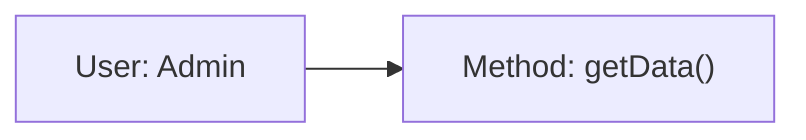

**方案 2：HTML 实体**

```mermaid
flowchart LR
    A["User&#58; Admin"] --> B["Method&#58; getData()"]
```

### 常用 HTML 实体

| 字符 | HTML 实体 |
|------|-----------|
| `:` | `&#58;` |
| `(` | `&#40;` |
| `)` | `&#41;` |
| `[` | `&#91;` |
| `]` | `&#93;` |
| `{` | `&#123;` |
| `}` | `&#125;` |

---

## 错误 2：保留字 end 冲突

### 症状

```
Parse error: Unexpected end of input
```

或图表在 `end` 节点处截断。

### 原因

`end` 是 Mermaid 的保留字，用于结束 subgraph、alt、loop 等块。

### 错误示例

```mermaid
flowchart LR
    start --> process --> end
```

### 正确写法

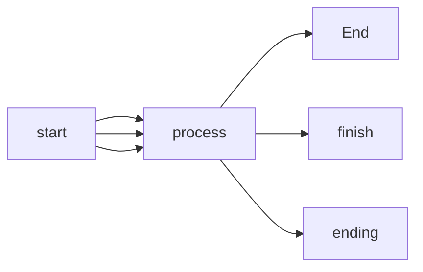

### 其他需要注意的保留字

- `end` - 块结束
- `subgraph` - 子图开始
- `direction` - 方向指令
- `click` - 点击事件
- `style` - 样式定义
- `classDef` - 类定义

---

## 错误 3：subgraph 缺少 ID

### 症状

```
Error: subgraph not found: undefined
```

或 subgraph 内的节点无法被外部引用。

### 原因

subgraph 只有标题没有 ID，导致引用失败。

### 错误示例

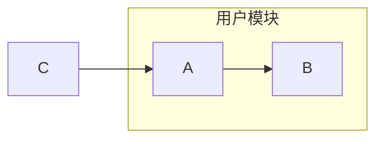

### 正确写法


### 规则

- `subgraph ID["显示标题"]`
- ID 用于代码引用（英文无空格）
- 标题用于显示（可以是中文）

---

## 错误 4：note 在非序列图中使用

### 症状

```
Parse error: Unexpected token 'note'
```

### 原因

`note` 关键字只在 `sequenceDiagram` 和 `stateDiagram-v2` 中有效。

### 错误示例

```mermaid
flowchart LR
    A --> B
    note right of B: 这是说明
```

### 正确写法

**flowchart 中的替代方案**

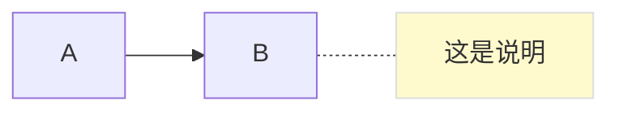

**sequenceDiagram 中正确使用**

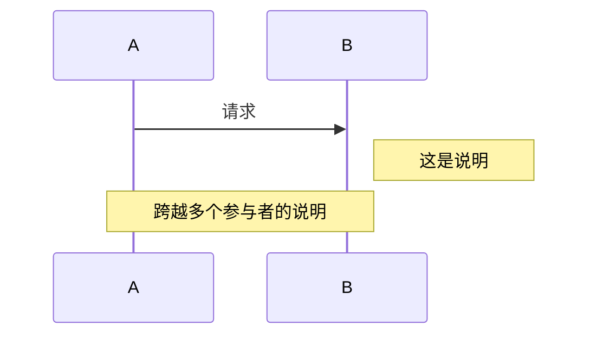

### note 的变体（仅限 sequenceDiagram）

| 语法 | 位置 |
|------|------|
| `note right of A` | A 右侧 |
| `note left of A` | A 左侧 |
| `note over A` | A 上方 |
| `note over A,B` | 跨越 A 和 B |

---

## 错误 5：classDiagram 关系定义在类之前

### 症状

```
Error: class 'ClassName' not found
```

或类之间的关系线不显示。

### 原因

在 classDiagram 中引用了未定义的类。

### 错误示例

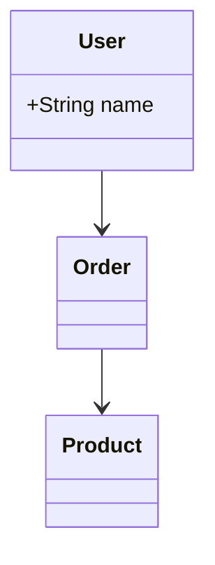

### 正确写法

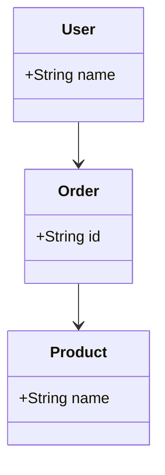

### 最佳实践

1. **先定义所有类**
2. **再定义关系**
3. **最后添加注解**

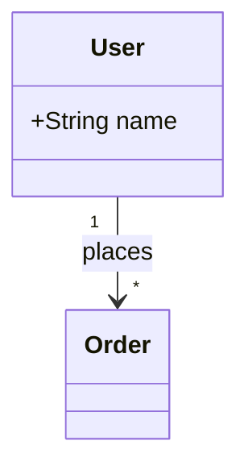

---

## 错误 6：中文文本渲染异常

### 症状

中文标签显示为方块、乱码，或字体与英文不一致。

### 原因

部分渲染环境（如 CLI 工具、老版浏览器）默认字体不支持中文。

### 解决方案

**方案 1：init 配置指定中文字体**

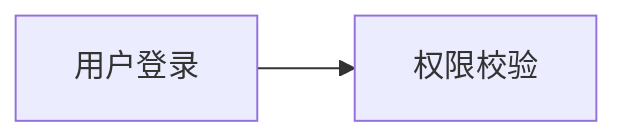

**方案 2：中文文本加双引号**


### 注意

- `%%{init: ...}%%` 必须放在代码块第一行
- 中文文本建议始终用双引号包裹，避免特殊字符问题

---

## 错误 7：甘特图日期不匹配

### 症状

```
Error: Invalid date format
```

或甘特图不渲染、日期显示异常。

### 原因

任务日期格式与 `dateFormat` 声明不一致。

### 错误示例

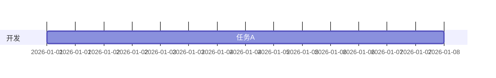

### 正确写法


### 常见格式对照

| dateFormat | 正确日期 | 错误日期 |
|------------|---------|---------|
| `YYYY-MM-DD` | `2026-01-01` | `2026/01/01`、`01-01-2026` |
| `DD/MM/YYYY` | `01/01/2026` | `2026-01-01` |

---

## 错误 8：init 主题配置不生效

### 症状

设置了主题或字体但没有效果，图表仍使用默认样式。

### 原因

`%%{init: {...}}%%` 没有放在 Mermaid 代码块的第一行。

### 错误示例

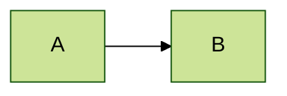

### 正确写法


---

## 错误 9：长文本导致节点过宽

### 症状

图表水平溢出，节点文本挤成一团或超出可视区域。

### 原因

Mermaid 节点文本默认不自动换行。

### 解决方案

**方案 1：使用 `<br/>` 手动换行**

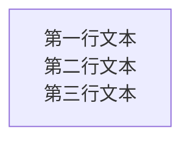

**方案 2：控制文本长度，拆分为多个节点**

```mermaid
flowchart TD
    A["主要操作"] --> B["详细说明"]
```

### 最佳实践

- 节点文本控制在 15 个字符以内
- 超长描述用 subgraph 标题或注释节点补充

---

## 通用调试技巧

### 1. 逐步添加

从最小可工作的图开始，逐步添加元素，定位问题。

**步骤 1：最小图**

```mermaid
flowchart LR
    A --> B
```

**步骤 2：添加节点**

```mermaid
flowchart LR
    A --> B --> C
```

**步骤 3：添加标签**

```mermaid
flowchart LR
    A["节点A"] --> B["节点B"] --> C["节点C"]
```

### 2. 使用在线编辑器

[Mermaid Live Editor](https://mermaid.live) 提供实时错误提示。

### 3. 检查版本兼容性

某些语法仅在新版本中支持：
- `stateDiagram-v2`（推荐）vs `stateDiagram`
- `flowchart`（推荐）vs `graph`

### 4. 注释定位

使用 `%%` 注释暂时禁用可疑代码：

```mermaid
flowchart LR
    A --> B
    %% C --> D  暂时禁用
    E --> F
```
