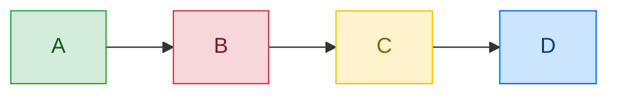
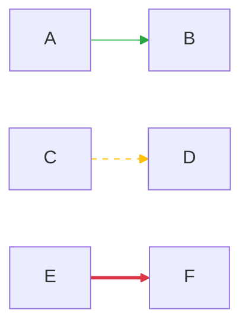
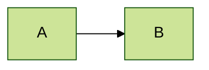

# 二、样式配置与工具

> 执行步骤见 SKILL.md "执行步骤"章节（6 步），此处仅保留 SKILL.md 不覆盖的样式/工具配置。

## 样式配置

### 节点样式



### 常用颜色语义

| 语义 | fill | stroke | 用途 |
|------|------|--------|------|
| 成功/正常 | `#d4edda` | `#28a745` | 正常流程、成功状态 |
| 错误/失败 | `#f8d7da` | `#dc3545` | 异常分支、错误状态 |
| 警告/注意 | `#fff3cd` | `#ffc107` | 需关注的节点 |
| 信息/中性 | `#cce5ff` | `#0d6efd` | 说明性节点 |
| 高亮/重点 | `#e2d5f1` | `#6f42c1` | 关键路径、核心节点 |

### 连线样式



### 主题配置



**可用主题**：`default`（默认）、`forest`（绿色）、`dark`（深色）、`neutral`（中性）、`base`（基础，可自定义）

**自定义主题变量**：

```
%%{init: {
  'theme': 'base',
  'themeVariables': {
    'primaryColor': '#4a90d9',
    'primaryTextColor': '#fff',
    'primaryBorderColor': '#2c6fbb',
    'lineColor': '#5a6c7d',
    'fontFamily': 'Microsoft YaHei, sans-serif'
  }
}}%%
```

**在线验证**：[Mermaid Live Editor](https://mermaid.live)

---

# 三、标准 init 配置预设

> 统一图表风格，解决中文字体、节点间距、连线曲率的跨环境一致性问题。

### 推荐配置（复制即用）

```
%%{init: {'theme': 'base', 'themeVariables': {'primaryColor': '#e2d5f1', 'primaryBorderColor': '#6f42c1', 'lineColor': '#5a6c7d', 'fontSize': '14px', 'fontFamily': 'Microsoft YaHei, PingFang SC, sans-serif'}, 'flowchart': {'nodeSpacing': 30, 'rankSpacing': 40, 'curve': 'basis'}}}%%
```

### 参数说明

| 参数 | 值 | 说明 |
|------|------|------|
| `theme` | `base` | 基础主题，便于自定义 |
| `primaryColor` | `#e2d5f1` | 与 `core` classDef 一致 |
| `primaryBorderColor` | `#6f42c1` | 核心元素边框色 |
| `lineColor` | `#5a6c7d` | 连线颜色，柔和不刺眼 |
| `fontSize` | `14px` | 适中字号，兼顾可读性和信息密度 |
| `fontFamily` | `Microsoft YaHei, PingFang SC, sans-serif` | 中文字体优先 |
| `nodeSpacing` | `30` | 节点水平间距 |
| `rankSpacing` | `40` | 层级垂直间距 |
| `curve` | `basis` | 平滑曲线连接，减少视觉杂乱 |

### 使用场景

| 场景 | 是否使用 init |
|------|:---:|
| 简单图（≤5 节点） | 可选 |
| 含中文的图表 | 推荐 |
| 需要跨环境一致渲染 | 必须 |
| 调用链/架构图 | 推荐 |

> **注意**：`%%{init: ...}%%` 必须写在代码块第一行，且为单行。

---

# 四、init 多行格式说明

`%%{init: ...}%%` 必须写在 **同一行** 内（即使内容很长），不能拆成多行。上方"自定义主题变量"示例中的多行写法仅用于可读性展示，实际使用时需合并为单行：


> **注意**：部分渲染器（如 Mermaid Live Editor）支持多行 init，但为保证兼容性，建议始终使用单行格式。

---

# 五、HTML 标签名陷阱

### 症状

节点文本中包含 `<br/>` 以外的 HTML 标签（如 `<div>`、`<span>`）时，可能导致解析异常或 XSS 风险。

### 原因

Mermaid 仅支持有限的 HTML 标签（`<br/>`、`<b>`、`<i>`、`<u>`、`<s>`），其他标签会被过滤或导致错误。

### 正确做法


### 不支持的写法

```
A["<div>内容</div>"]     %% 不支持 div
A["<span>内容</span>"]   %% 不支�� span
A[""]      %% 不支持 img
```

---

# 六、验证工具推荐

| 工具 | 类型 | 用途 |
|------|------|------|
| [Mermaid Live Editor](https://mermaid.live) | 在线编辑器 | 实时预览、语法检查、分享链接 |
| [mermaid-cli (mmdc)](https://github.com/mermaid-js/mermaid-cli) | CLI 工具 | 批量生成 SVG/PNG/PDF，CI 集成 |
| GitHub / GitLab Markdown | 内置渲染 | 直接在 README/Issue 中渲染 Mermaid |
| VS Code Mermaid 插件 | IDE 插件 | 编辑器内实时预览 |

### 推荐验证流程

1. **编写阶段**：使用 VS Code Mermaid 插件实时预览
2. **提交前**：在 Mermaid Live Editor 中最终确认
3. **CI 集成**：使用 mermaid-cli 验证语法正确性
