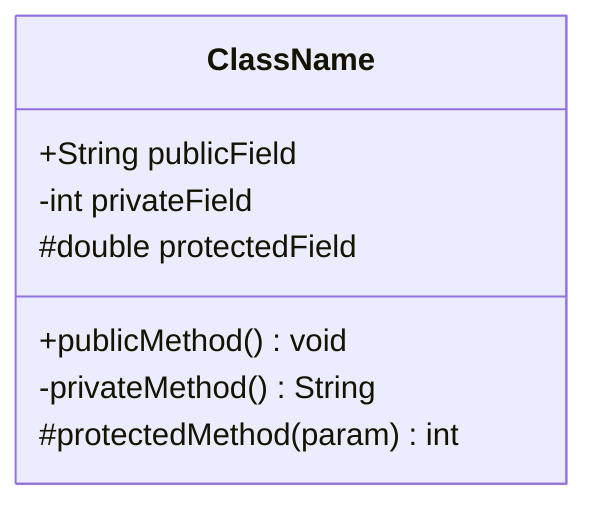
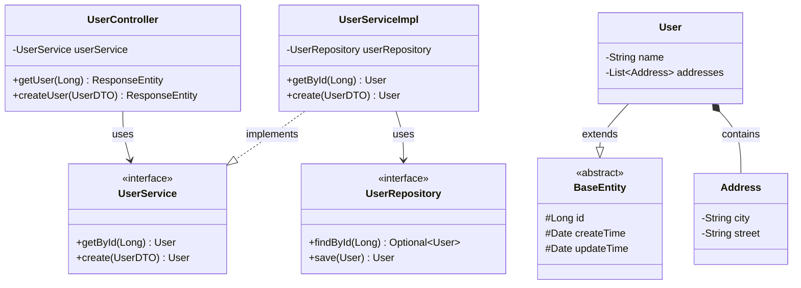
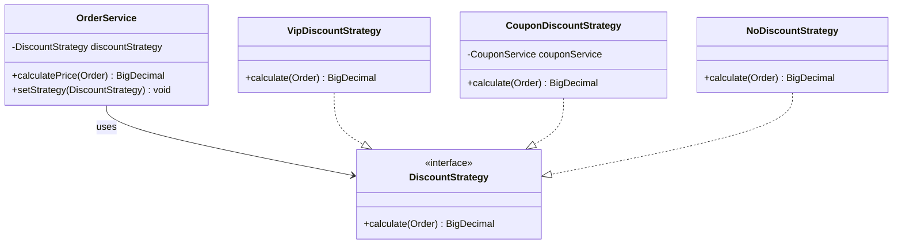
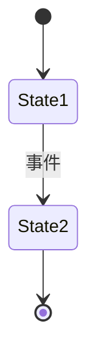
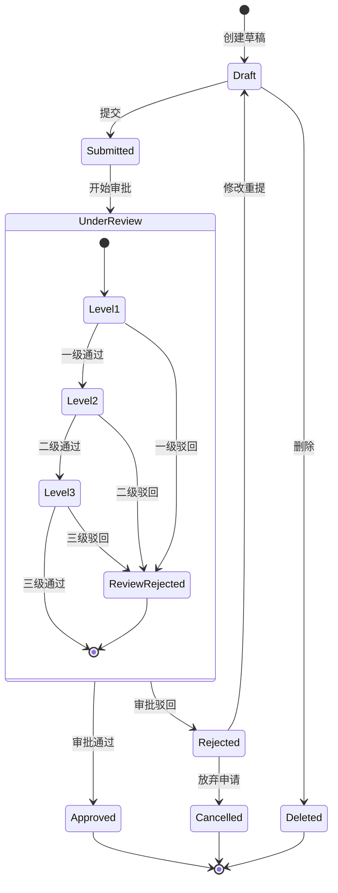

# 三、类图模板（classDiagram）

## 骨架模板

---

## 业务示例（含继承/实现/组合/关联）

---

## 设计模式示例（策略模式）

---

## 语法速查

| 语法 | 含义 |
|------|------|
| `+`/`-`/`#`/`~` | public/private/protected/package |
| `<\|--` | 继承 |
| `..\|>` | 实现 |
| `*--` | 组合（强拥有） |
| `o--` | 聚合（弱拥有） |
| `-->` | 关联 |
| `..>` | 依赖 |
| `"1"`/`"*"`/`"1..*"`/`"0..1"` | 基数标注 |
| `<<interface>>` / `<<abstract>>` | 类型标注 |
| `~Type~` | 泛型（如 `List~User~`） |

---

# 四、状态图模板（stateDiagram-v2）

## 骨架模板

---

## 业务示例（含嵌套状态）

---

## 语法速查

| 语法 | 含义 |
|------|------|
| `[*]` | 开始/结束状态 |
| `state name {}` | 复合状态（嵌套，最多3层） |
| `<<choice>>` / `<<fork>>` / `<<join>>` | 选择/分叉/合并 |
| `State1 --> State2 : 事件` | 基本转换 |
| `State1 --> State2 : 事件 [守卫] / 动作` | 完整转换 |
| `note right of State1 : 文字` | 注释 |

**规范**：始终用 `stateDiagram-v2`，状态名用 PascalCase 或全大写
