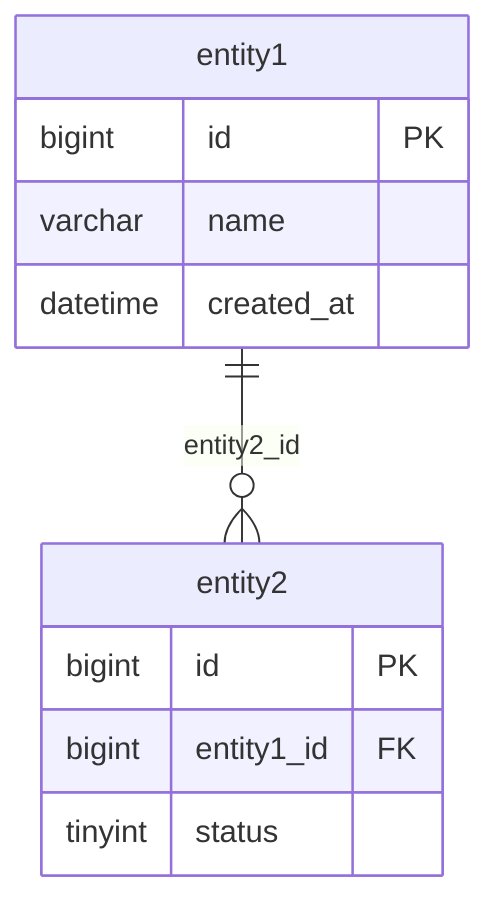
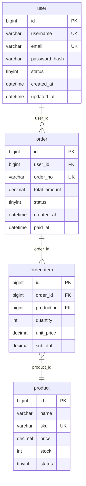
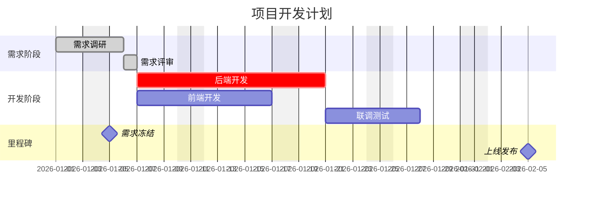
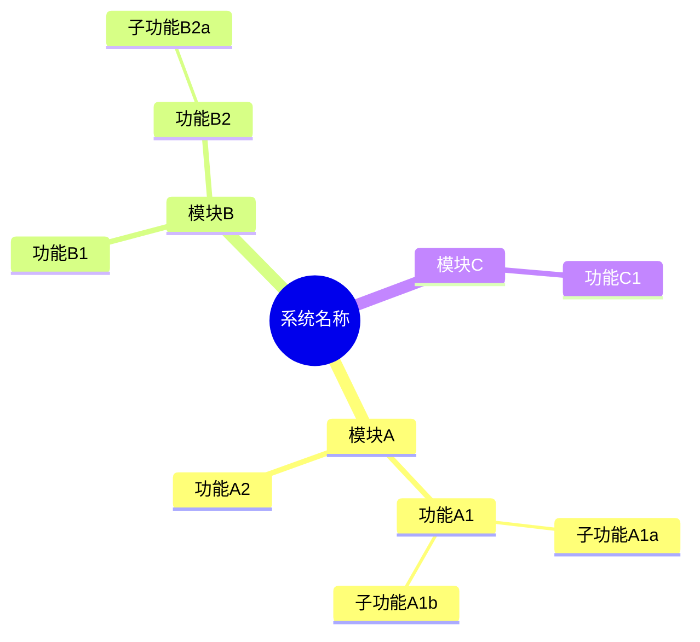
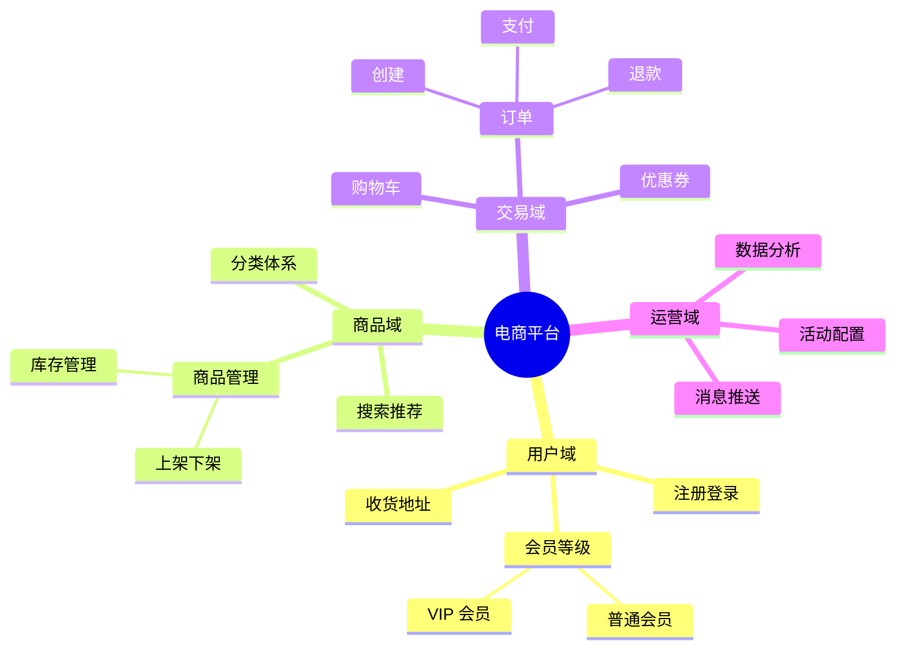

# 五、ER 图模板（erDiagram）

> ER 图规范详见 `cc-api-analyzer/references/er-guide.md`，本模板为简化版

## 骨架模板

---

## 业务示例（多表关联）

---

## 语法速查

| 语法 | 含义 |
|------|------|
| `\|\|` | 恰好一个（必须） |
| `o\|` | 零或一个（可选） |
| `}o` | 零或多个 |
| `}\|` | 一个或多个 |
| `PK` / `FK` / `UK` | 主键 / 外键 / 唯一键 |

**常用类型**：`bigint`(ID), `int`(数量), `tinyint`(状态), `varchar`(文本), `decimal`(金额), `datetime`(时间), `json`

**规范**：表名小写、外键命名 `表名_id`、关系标签用 FK 列名（`user_id`、`order_id`），禁止泛化词（`has`、`contains`、`places`）。建议添加业务注释（`%% 表名: 业务描述`），表较多时按模块分组

# 六、甘特图模板（gantt）

## 骨架模板

---

## 语法速查

| 语法/标记 | 含义 |
|-----------|------|
| `dateFormat YYYY-MM-DD` | 日期格式 |
| `axisFormat %m/%d` | 显示格式 |
| `done` / `active` / `crit` / `milestone` | 已完成/进行中/关键/里程碑 |
| `:id, 2026-01-01, 7d` | 日期+天数 |
| `:id, after task1, 3d` | 前置依赖 |
| `excludes weekends` | 排除周末 |

**常见问题**：日期必须用 ISO 格式（`YYYY-MM-DD`），避免任务依赖循环，里程碑持续时间为 `0d`。详见 `resources.md`。

# 七、思维导图模板（mindmap）

## 骨架模板

---

## 业务示例（电商系统模块拆解）

---

## 语法速查

| 语法 | 形状 |
|------|------|
| `文本` | 默认矩形 |
| `((文本))` | 圆形（通常根节点） |
| `[文本]` | 方形 |
| `)文本(` | 云形 |
| `))文本((` | 爆炸形 |
| `{{文本}}` | 六边形 |

**规范**：用缩进表示层级，保持一致的缩进风格（2或4空格），每级节点不超过7个

**常见问题**：缩进必须一致（空格或Tab不能混用），特殊字符用引号包裹。详见 `resources.md`。
