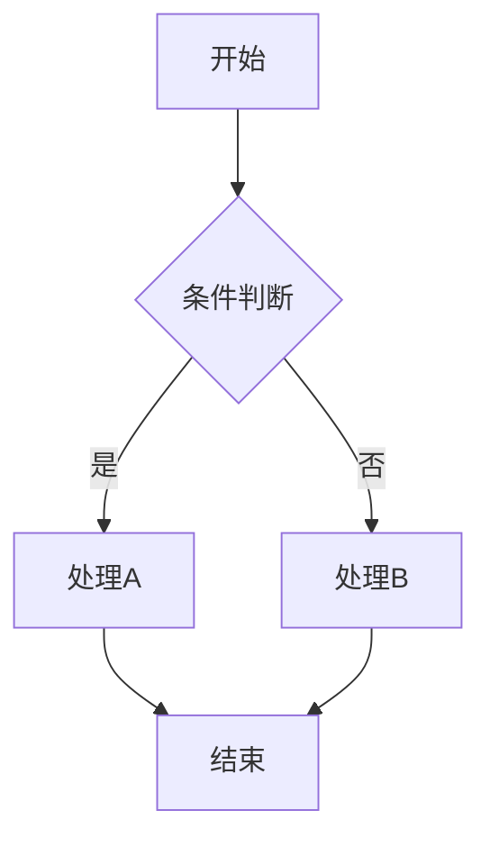
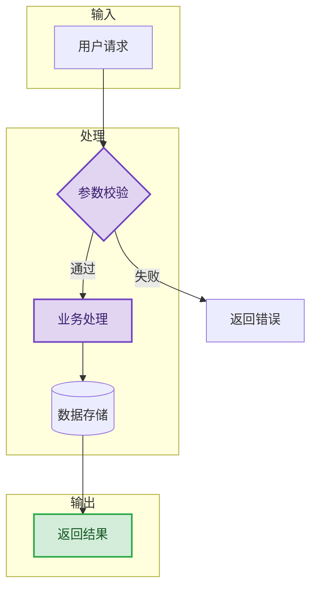
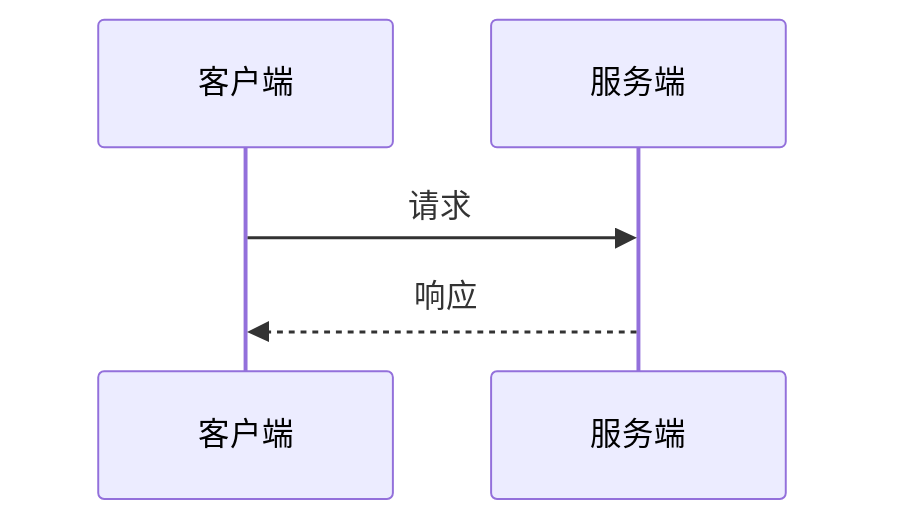
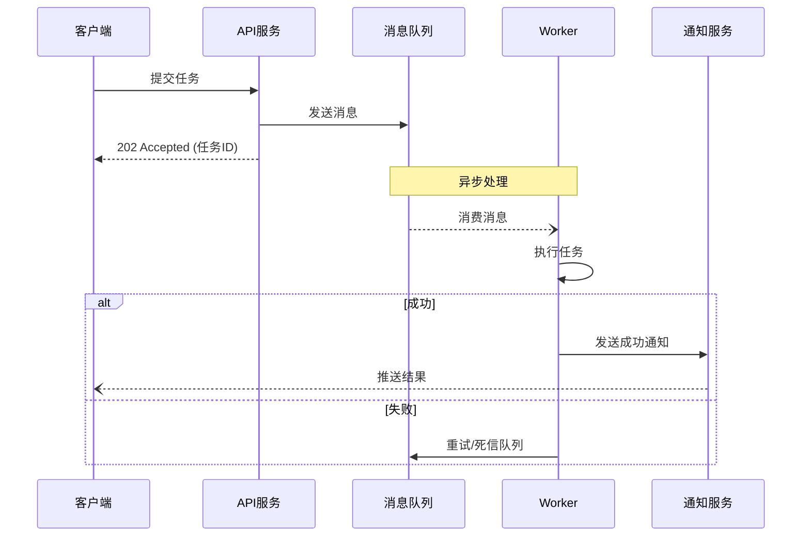

# 一、流程图模板（flowchart）

## 骨架模板

---

## 业务流程模板（含 subgraph）

---

## 语法速查

| 语法 | 形状 | 用途 |
|------|------|------|
| `[文本]` | 矩形 | 普通步骤 |
| `(文本)` | 圆角矩形 | 柔和步骤 |
| `{文本}` | 菱形 | 判断条件 |
| `((文本))` | 圆形 | 开始/结束 |
| `[(文本)]` | 圆柱形 | 数据库 |
| `[[文本]]` | 子流程框 | 子流程调用 |
| `-->` | 实线箭头 | 连线 |
| `-.->` | 虚线箭头 | 弱连线 |
| `==>` | 粗线箭头 | 强调连线 |
| `-->\|标签\|` | 带标签 | 条件说明 |

**方向**：`TD`(上到下)、`LR`(左到右)、`BT`(下到上)、`RL`(右到左)

---

# 二、序列图模板（sequenceDiagram）

## 骨架模板

---

## 业务示例（含 alt/loop/par）

---

## 语法速查

| 语法 | 用途 |
|------|------|
| `->>` / `-->>` | 同步请求 / 响应 |
| `--)` / `---)` | 异步消息 / 响应 |
| `-x` | 失败/错误 |
| `alt/else/end` | 条件分支 |
| `opt/end` | 可选操作 |
| `loop/end` | 循环 |
| `par/and/end` | 并行 |
| `critical/end` | 关键区域 |
| `rect rgb()/end` | 高亮区域 |
| `Note over A,B:` | 说明文字 |
