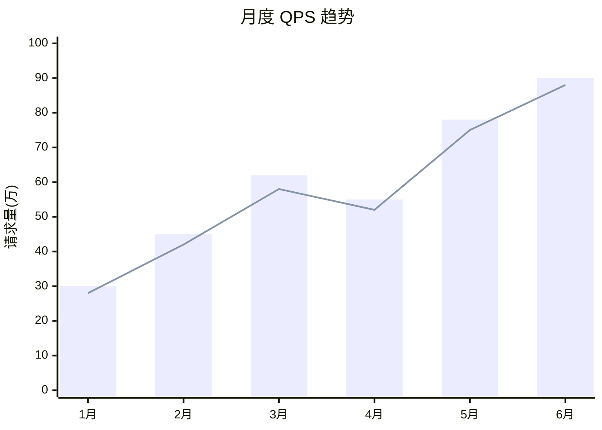
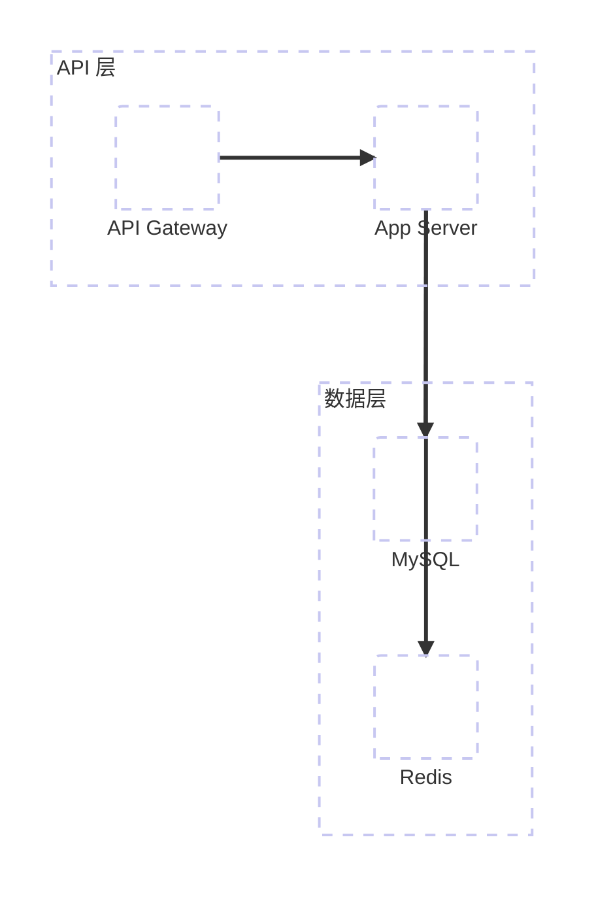
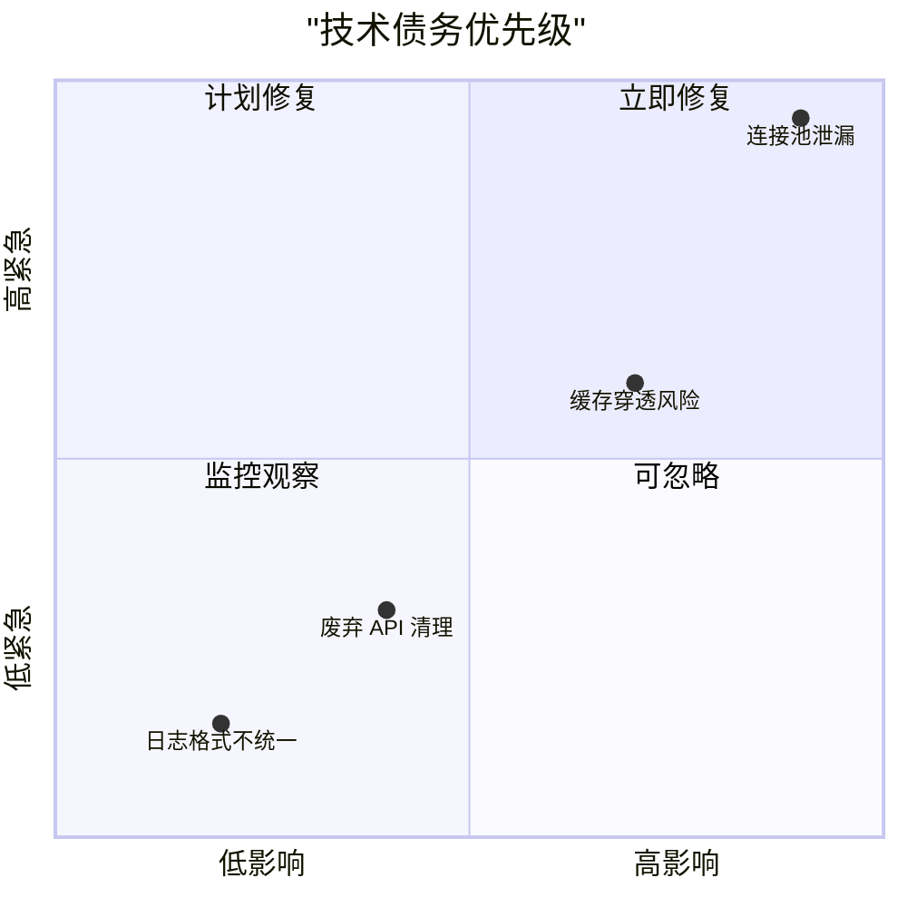

# 新增图表模板（Mermaid v10.3+ / v11+）

> 5 种新图表的骨架模板 + 语法速查 + 防错要点。

---

## 一、XY 图表（xychart-beta）

> 柱状图 + 折线图，Mermaid v10.7+ 支持。统计分析的核心图表。

### 骨架模板



### 语法速查

| 语法 | 含义 |
|------|------|
| `xychart-beta` | 图表声明（必须带 `-beta`） |
| `title "标题"` | 图表标题（双引号包裹） |
| `x-axis ["A", "B"]` | X 轴标签（数组格式） |
| `y-axis "label" min --> max` | Y 轴标签 + 范围 |
| `bar [1, 2, 3]` | 柱状数据 |
| `line [1, 2, 3]` | 折线数据 |

### 防错要点

- ⛔ 必须写 `xychart-beta`，不能省略 `-beta`
- x-axis 标签数量必须与 bar/line 数据长度一致
- 可同时包含多组 bar 和 line
- 标签含特殊字符时用双引号包裹
- ⚠️ 不支持双 Y 轴：柱状和折线共享同一 Y 轴范围。如需展示不同量纲（如数量+百分比），应拆为两张图或先归一化数据

### xychart-beta 已知限制与降级方案

> xychart-beta 适合简单趋势（单线/双线同量纲），**复杂统计图建议用 Obsidian Charts 插件**。

| 限制 | 影响 | 降级方案 |
|------|------|---------|
| 无图例标签（[Issue #5292](https://github.com/mermaid-js/mermaid/issues/5292)） | 多线无法区分 | 图后用 HTML span 色块标注（见下方模板） |
| 不支持 null/断线 | 有缺口的数据线会错误连接 | 剔除缺口日期或用 Obsidian Charts（Chart.js 原生支持 null） |
| Y 轴范围小时视觉夸张 | 2-3% 的差异看起来像断崖 | 配合文字说明实际差值 |
| 渲染质量一般 | 线条粗细/颜色辨识度低 | 复杂多维对比用 Obsidian Charts（`dataviewjs` 代码块 + Chart.js） |

**Obsidian Charts 推荐场景**：3 条线以上、有数据缺口、需要原生图例、需要悬停交互。如果目标环境是 Obsidian 且装了插件，优先用 Chart.js 而非 xychart-beta。
- ⚠️ 多条线无原生图例（Mermaid 限制，[Issue #5292](https://github.com/mermaid-js/mermaid/issues/5292) 仍 OPEN）。**保持同图对比** + 紧跟 HTML 内联色块图例：

```html
图例写法（紧跟 xychart 代码块之后，用 HTML span 配色）：
<small><span style="color:#4a90d9">━━━</span> 总T0率 &emsp; <span style="color:#c4b5d9">━━━</span> hb渠道 &emsp; <span style="color:#e8a87c">━━━</span> weapp渠道</small>

xychart 默认配色顺序（Obsidian/GitHub 渲染器）：
  第1条线: #4a90d9（蓝）
  第2条线: #c4b5d9（浅紫）
  第3条线: #e8a87c（橙）
```

---

## 二、桑基图（sankey-beta）

> 流量/资金/用户流向可视化，Mermaid v10.3+ 支持。

### 骨架模板

```mermaid
sankey-beta

首页,注册页,500
首页,商品页,300
首页,离开,200
注册页,激活,350
注册页,放弃,150
商品页,下单,180
商品页,离开,120
```

### 语法速查

| 语法 | 含义 |
|------|------|
| `sankey-beta` | 图表声明（必须带 `-beta`） |
| `源,目标,数值` | 每行一条流（CSV 格式） |

### 防错要点

- ⛔ 必须写 `sankey-beta`，不能省略 `-beta`
- 每行格式：`源节点,目标节点,数值`（逗号分隔，无空格）
- 节点名称自动从数据中提取，无需预定义
- 不支持 classDef 样式，颜色由渲染器自动分配
- 数值必须为正数

---

## 三、云架构图（architecture-beta）

> 带图标的部署架构/云服务拓扑，Mermaid v11.1+ 支持。

### 骨架模板



### 语法速查

| 语法 | 含义 |
|------|------|
| `architecture-beta` | 图表声明（必须带 `-beta`） |
| `group id["标题"]` | 分组（类似 subgraph） |
| `service id["标签"] in group` | 服务节点 |
| `A:方向 --> 方向:B` | 连线（方向: T/B/L/R） |

### 防错要点

- ⛔ 必须写 `architecture-beta`，不能省略 `-beta`
- 连线方向用 T(上)/B(下)/L(左)/R(右) 指定端口
- service 必须声明在 group 内（`in groupId`）
- 支持 `icon()` 语法引用图标（需 iconify 支持）

---

## 四、象限图（quadrantChart）

> 二维矩阵评估（优先级/影响力-紧急度），Mermaid v10.3+ 支持。

### 骨架模板



### 语法速查

| 语法 | 含义 |
|------|------|
| `quadrantChart` | 图表声明（无 -beta） |
| `x-axis "低" --> "高"` | X 轴两端标签 |
| `y-axis "低" --> "高"` | Y 轴两端标签 |
| `quadrant-1` ~ `quadrant-4` | 四象限标签（1=右上, 2=左上, 3=左下, 4=右下） |
| `"标签": [x, y]` | 数据点（x/y 范围 0~1） |

### 防错要点

- quadrant 编号：1=右上、2=左上、3=左下、4=右下（非直觉顺序）
- 坐标值范围 0.0~1.0
- 数据点标签必须用双引号包裹

---

## 五、雷达图（radar）

> 多维度对比评估，Mermaid v11.6+ 支持。

### 骨架模板

```mermaid
radar
    title "方案对比评估"
    axis 性能, 安全性, 可维护性, 成本, 扩展性

    "方案A" --> 8, 9, 7, 5, 8
    "方案B" --> 6, 7, 9, 8, 6
    "方案C" --> 9, 6, 5, 7, 9
```

### 语法速查

| 语法 | 含义 |
|------|------|
| `radar` | 图表声明（无 -beta） |
| `title "标题"` | 图表标题 |
| `axis A, B, C` | 维度轴（逗号分隔） |
| `"标签" --> v1, v2, v3` | 数据系列 |

### 防错要点

- Mermaid v11.6+ 才支持，旧版本会渲染失败
- 数据值数量必须与 axis 维度数量一致
- 建议维度 3~7 个（过多会拥挤）
- 数据值范围建议 0~10

---

# Obsidian Charts 插件模板（写入 Obsidian 时优先使用）

> 适用于写入 Obsidian 知识库的数据图表。基于 Chart.js，原生支持图例、null 断线、悬停交互。
> **使用条件**：输出目标为 Obsidian 文件（路径含 `shuhe-kb/` 或 `tools/`）且图表类型为数据类（line/bar/pie/radar/doughnut）。
> **结构图表**（flowchart/sequence/class/state/ER/mindmap/gantt/architecture）仍用 Mermaid。

## 折线图（line）

```chart
type: line
labels: ["3/9","3/10","3/11","3/12","3/13","3/14"]
series:
  - title: 总T0率
    data: [81.2, 81.3, 78.2, 79.0, 80.0, 78.4]
  - title: hb渠道
    data: [81.5, 80.4, 78.6, 79.7, 80.3, 78.4]
  - title: weapp渠道
    data: [80.7, 83.6, 76.8, 77.1, 75.0, null]
tension: 0.3
width: 100%
labelColors: true
fill: false
spanGaps: false
beginAtZero: false
```

**要点**：
- `null` 值自动断线（`spanGaps: false`）
- `tension: 0.3` 平滑曲线（0=折线，0.4=更圆滑）
- 图例由插件自动渲染，无需手动标注
- `beginAtZero: false` 让 Y 轴从数据最小值附近开始

## 柱状图（bar）

```chart
type: bar
labels: ["前端组","后端组","测试组","运维组"]
series:
  - title: Bug数量
    data: [35, 28, 12, 8]
width: 80%
labelColors: true
beginAtZero: true
```

## 饼图（pie / doughnut）

```chart
type: pie
labels: ["余额不足","渠道拒绝","系统超时","卡异常","风控拦截","其他"]
series:
  - title: 失败原因
    data: [35, 28, 15, 10, 8, 4]
width: 80%
labelColors: true
```

> `type: doughnut` 可改为环形图。

## 雷达图（radar）

```chart
type: radar
labels: ["性能","安全性","可维护性","成本","扩展性"]
series:
  - title: 方案A
    data: [8, 9, 7, 5, 8]
  - title: 方案B
    data: [6, 7, 9, 8, 6]
width: 80%
labelColors: true
fill: true
```

## 防错要点

- 代码块标记为 ` ```chart `（不是 `mermaid`）
- YAML 格式，缩进用空格不用 Tab
- `series` 下每项必须有 `title` 和 `data`
- `data` 数组长度必须与 `labels` 数组长度一致
- `null` 值在 `spanGaps: false` 时自动断线
- 不支持自定义颜色（`borderColor` 无效），使用插件默认调色板即可
