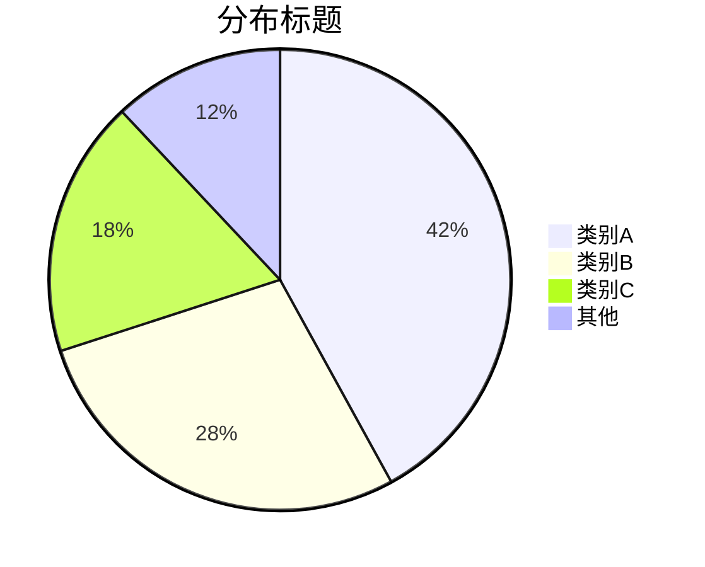
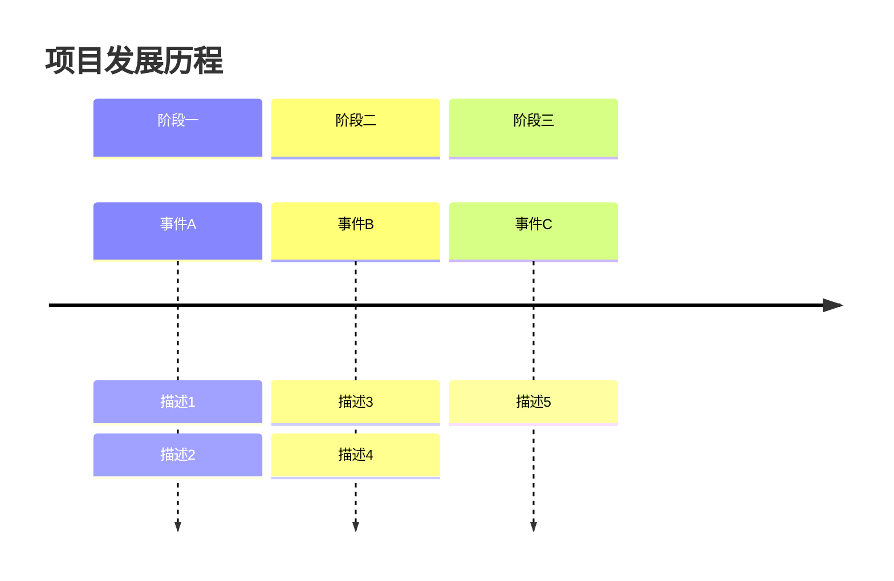
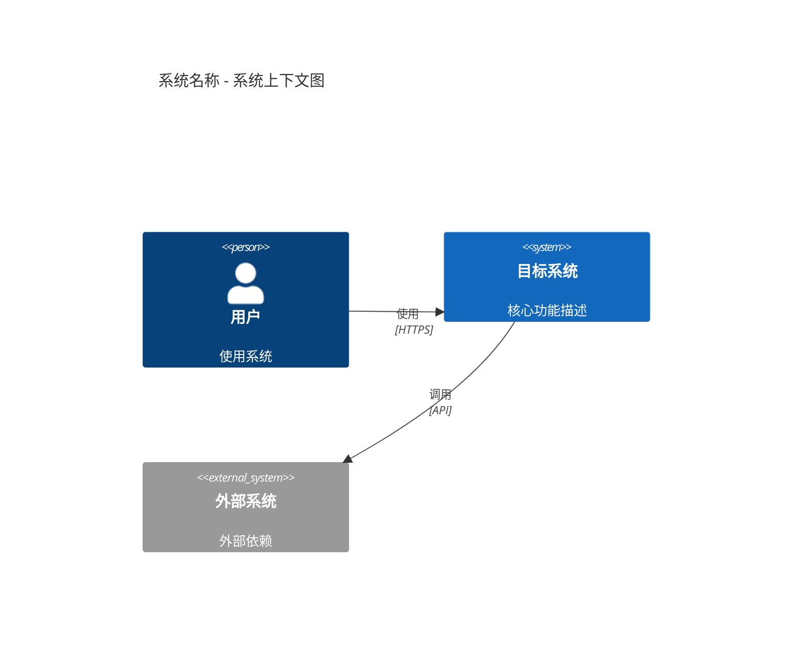
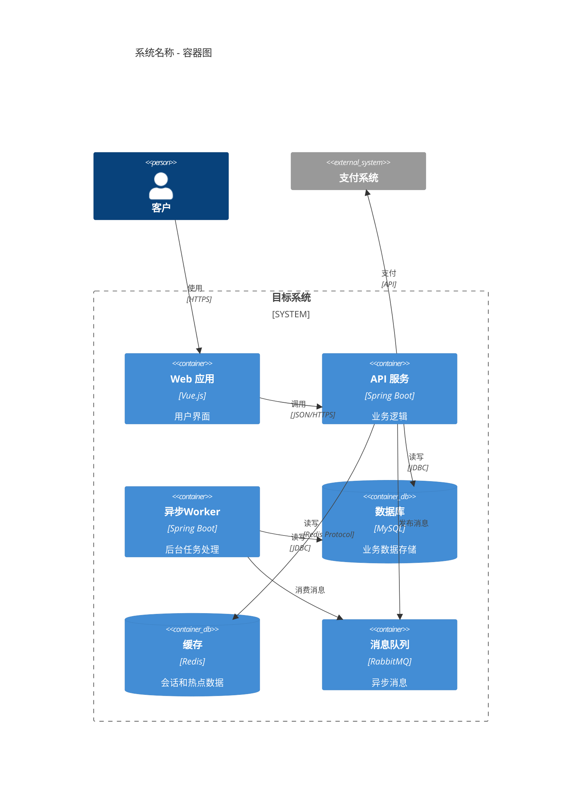

# 八、饼图模板（pie）

## 骨架模板

---

## 语法速查

| 语法 | 含义 |
|------|------|
| `pie title 标题` | 带标题的饼图 |
| `pie showData` | 显示数值 |
| `"标签" : 数值` | 扇区定义（数值会自动转为百分比） |

**规范**：标签用双引号包裹，数值为正数，建议扇区不超过 7 个

# 九、时间线模板（timeline）

## 骨架模板

---

## 语法速查

| 语法 | 含义 |
|------|------|
| `timeline` | 时间线声明 |
| `title 标题` | 图表标题 |
| `section 分段` | 时间分段 |
| `时间点 : 事件` | 事件定义 |
| `         : 事件` | 同一时间点的多个事件（缩进对齐） |

**规范**：时间点按时间顺序排列，每个时间点的事件不超过 5 个

# 十、C4 架构图模板

> C4 模型分为 4 层：Context（系统上下文）、Container（容器）、Component（组件）、Code（代码）。Mermaid 目前支持 C4Context、C4Container、C4Component、C4Deployment。

## 骨架模板（C4Context）

---

## 业务示例（C4Container）

---

## 语法速查

| 语法 | 含义 |
|------|------|
| `Person(id, "名称", "描述")` | 用户/角色 |
| `System(id, "名称", "描述")` | 内部系统 |
| `System_Ext(id, "名称", "描述")` | 外部系统 |
| `System_Boundary(id, "名称") {}` | 系统边界 |
| `Container(id, "名称", "技术", "描述")` | 容器 |
| `ContainerDb(id, "名称", "技术", "描述")` | 数据库容器 |
| `Rel(from, to, "描述", "协议")` | 关系 |

**规范**：从高层（Context）到低层（Component）逐步细化，每层图中元素不超过 15 个
