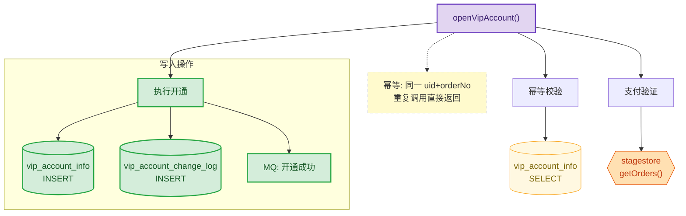

# 视觉重点规范与示例

> 本文件从 SKILL.md 外迁，包含数据契约映射、视觉重点详细实现、classDef 配色声明、各图表类型示例代码、备注规范。

---

## 零、接收数据契约映射

> 字段定义见 `shared-rules/data-contracts.md`。本节说明 diagram 如何将契约字段映射为 Mermaid 语法。

**cc-api-analyzer → cc-diagram（ER 图）**

| 输入字段 | 映射到 Mermaid |
|---------|---------------|
| `entities[].name` | erDiagram 实体名（大写） |
| `entities[].fields` | 实体属性列表（含 PK/FK 标注） |
| `relationships[].type` | 关系符号：`1:1` → `\|\|--\|\|`、`1:N` → `\|\|--o{`、`N:N` → 拆中间表 |
| `relationships[].label` | 关系标签（FK 列名，如 `user_id`） |

**design → cc-diagram（架构图等）**

| 输入字段 | 处理方式 |
|---------|---------|
| `diagram_type` | 直接用作图表类型选择，跳过决策树 |
| `diagram_data` | 解析为节点和关系，应用对应模板 |
| `title`（可选） | 作为 subgraph 标题或注释 |
| `highlights.core` | 标注为核心元素 → 应用 `:::core` 紫色高亮 |
| `highlights.newAdd` | 标注为新增/变更 → 应用 `:::newAdd` 绿色标注 |
| `highlights.extensionPoints` | 标注为扩展点 → 虚线边框或注释 |

---

## 一、统一色彩语义（全局唯一标准）

> **所有图表统一使用以下 classDef，禁止逐节点写 `style` 行。** 语义覆盖设计图 + 调用链两种场景。

| classDef | 色值（fill/stroke） | 语义 | 设计图用途 | 调用链用途 |
|----------|---------------------|------|-----------|-----------|
| `newAdd` | `#d4edda` / `#28a745` | 🟢 新增 | 新增组件 | INSERT 操作 |
| `modified` | `#cce5ff` / `#0d6efd` | 🔵 变更 | 变更组件 | UPDATE 操作 |
| `deleted` | `#f8d7da` / `#dc3545` | 🔴 删除 | 废弃组件 | 异常分支 |
| `core` | `#e2d5f1` / `#6f42c1` | 🟣 核心/入口 | 核心组件/扩展点 | 入口方法/主流程 |
| `external` | `#ffe0b2` / `#e65100` | 🟠 外部系统 | 外部依赖 | 外部服务调用 |
| `readOnly` | `#fff8e1` / `#f9a825` | 🟡 只读/查询 | — | SELECT 操作 |
| （默认） | 无 classDef | ⚪ 不变 | 已有组件 | 内部常规调用 |

**classDef 声明（复制即用）**：

```
classDef newAdd fill:#d4edda,stroke:#28a745,stroke-width:2px,color:#155724
classDef modified fill:#cce5ff,stroke:#0d6efd,stroke-width:2px,color:#084298
classDef deleted fill:#f8d7da,stroke:#dc3545,stroke-width:2px,color:#721c24
classDef core fill:#e2d5f1,stroke:#6f42c1,stroke-width:2px,color:#3b1f6e
classDef external fill:#ffe0b2,stroke:#e65100,stroke-width:1px,color:#bf360c
classDef readOnly fill:#fff8e1,stroke:#f9a825,stroke-width:1px,color:#7c6608
```

---

## 二、各图表类型的视觉重点实现

| 图表类型 | 核心层标注方式 | 新增/变更标注方式 | 扩展点标注方式 |
|---------|--------------|-----------------|--------------|
| **flowchart** | 核心节点用 `:::core`，关键路径用 `linkStyle` 加粗 | 新增 `:::newAdd`(绿)，变更 `:::modified`(蓝) | 虚线节点 `-.-` 标注扩展点 |
| **classDiagram** | 核心类加 `<<core>>` + `:::core` | 新增 `<<new>>` + `:::newAdd`，变更 `<<modified>>` + `:::modified` | 接口/抽象类标注为扩展点 |
| **sequenceDiagram** | 核心交互用 `rect rgb(226,213,241)` | 新增用 `rect rgb(212,237,218)`，变更用 `rect rgb(204,229,255)` | `note` 标注扩展说明 |
| **erDiagram** | 核心表用 `%%` 注释标注 | 新增 `%% [NEW]`，变更 `%% [MODIFIED]` | 预留字段用注释说明 |
| **stateDiagram-v2** | 核心状态用 `:::core` | 新增 `:::newAdd`，变更 `:::modified` | `note` 标注可扩展转换 |

---

## 三、图表标题与图例（强制）

每张图表**必须**包含：

1. **图表前一句话说明**（Markdown 文本，非图内元素）：说清楚「这张图展示了什么，**重点关注什么**」
2. **图表后有图例表格**（仅列本图实际使用的样式）：

```markdown
| 样式 | 含义 |
|------|------|
| 🟢 绿色 | 新增 |
| 🔵 蓝色 | 变更 |
| 🔴 红色 | 删除 |
| 🟣 紫色 | 核心/扩展点 |
| 🟠 橙色 | 外部系统 |
| 🟡 黄色 | 只读/查询 |
| 默认 | 已有/不变 |
```

---

## 四、信息密度控制（强制）

> **核心依据**：人类工作记忆约 4±1 块。超过认知负荷的图 = 无效图。

```
节点数控制：
├─ ≤ 7 个核心节点 → 单图展示
├─ 8~15 个节点 → 用 subgraph 分 2-3 组
└─ > 15 个节点 → 必须拆图
    ├─ 总览图：模块间关系（每模块一个节点）
    └─ 详情图：每模块单独展开

调用链特殊规则：
├─ 主流程（happy path）单独一张图
├─ 分支/异常路径独立图
└─ 同类重复节点可合并（如多个 SELECT 合为一个 subgraph）
```

**拆图信号**：
- 渲染后需要滚动才能看全 → 拆
- subgraph 超过 3 个且各自 > 5 节点 → 拆
- 连线交叉超过 3 处 → 调整布局方向或拆

### 分阶段展开策略

> 大型图表不要试图一张图说完所有事。按「总→分」渐进式展开，每张图保持可一屏阅读。

```
分阶段展开流程：
1. 总览图（L0）：全局视角，每个模块/阶段一个节点，≤7 节点
   → 输出后说明：「以下分 N 张详情图展开」
2. 详情图（L1）：每模块/阶段单独一张，展开内部细节
   → 图标题标明所属阶段：「阶段 1/N：XXX」
3. 交叉关系图（L2，可选）：跨模块的关联/依赖
   → 仅在模块间有复杂交互时才出
```

**分阶段规则**：

| 条件 | 处理 |
|------|------|
| 总节点 8~15 | 单图 + subgraph 分组即可 |
| 总节点 16~30 | 总览图 + 2~4 张详情图 |
| 总节点 >30 | 总览图 + 详情图 + 按需交叉关系图 |
| 统计分析多维度 | 每个维度一张独立图，最后一张总结对比 |

**阶段标记格式**：
- 总览图标题：`「XXX 全景」`
- 详情图标题：`「阶段 M/N：XXX」` 或 `「模块 M/N：XXX」`
- 每张详情图的 subgraph 中用虚线节点标注「→ 详见阶段 X」指向其他详情图

---

## 五、备注规范（强制）

> **核心原则**：每张图必须包含辅助理解的备注信息，帮助读者理解「为什么这样设计」而非仅看到「是什么」。

### 各图表类型的备注实现方式

| 图表类型 | 备注语法 | 用途示例 |
|---------|---------|---------|
| **flowchart** | 节点文本中用 `<br/>` 换行添加说明，或用独立节点 + 虚线连接 | 关键决策点的判断依据、异步/同步标注 |
| **classDiagram** | `note for ClassName "备注内容"` | 设计模式说明、职责边界、关键约束 |
| **sequenceDiagram** | `note right of Actor: 备注` 或 `note over A,B: 备注` | 业务规则、幂等说明、超时策略 |
| **erDiagram** | `%% 备注内容` 行内注释 | 索引说明、分表策略、字段约束 |
| **stateDiagram-v2** | `note right of State: 备注` | 状态转换条件、超时规则 |

### 备注内容选择指南

优先添加以下类型的备注（至少包含 1 条）：

1. **设计决策**：为什么选择这种方案（如"策略模式，便于扩展新类型"）
2. **关键约束**：限制条件或前置条件（如"需幂等，重复调用不影响结果"）
3. **交互说明**：调用方式或时序要点（如"异步回调，超时 30s"）
4. **业务规则**：核心业务逻辑摘要（如"金额 > 100 时需审批"）

---

## 六、完整示例

### flowchart 示例（调用链场景）

> **会员开通核心流程**：展示从请求到开通完成的主路径，重点关注**幂等校验**和**支付验证**两个关键步骤。



| 样式 | 含义 |
|------|------|
| 🟣 紫色 | 核心/扩展点 |
| 🟢 绿色 | 写入操作 |
| 🔵 蓝色 | 变更 |
| 🟠 橙色 | 外部系统 |
| 🟡 黄色 | 读取操作 |
| 虚线节点 | 关键约束说明 |

### classDiagram 示例

```mermaid
classDiagram
    class IEquityService {
        <<interface>>
        +grantEquity(request) Result
    }
    class RepayingBackEquityService {
        <<new>>
        +grantEquity(request) Result
        -calculateCashback() BigDecimal
    }
    class VideoEquityService {
        +grantEquity(request) Result
    }

    IEquityService <|.. RepayingBackEquityService
    IEquityService <|.. VideoEquityService

    note for IEquityService "策略模式：新增权益类型只需实现此接口"
    note for RepayingBackEquityService "本次新增：还款返现权益，含独立计算逻辑"

    classDef core fill:#e2d5f1,stroke:#6f42c1,stroke-width:2px,color:#3b1f6e
    classDef newAdd fill:#d4edda,stroke:#28a745,stroke-width:2px,color:#155724
    classDef modified fill:#cce5ff,stroke:#0d6efd,stroke-width:2px,color:#084298

    IEquityService:::core
    RepayingBackEquityService:::newAdd
```
