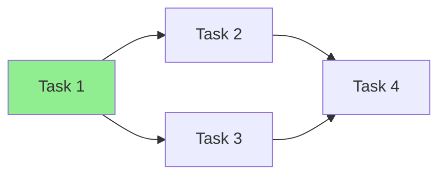

# plan-template

# [功能名称] 任务计划

> **PLAN.md = Prompt 理念**：本计划文件本身就是可执行的 prompt。
> 每个任务描述应足够详细，让执行者（无论是 Claude 还是开发者）可以直接开始工作。
> **⛔ 本文件位于 `$STARK_SESSION_DIR` 目录内，禁止在项目根目录创建或读写。**

**创建时间**: {{timestamp}}
**状态**: 待执行 | 执行中 | 已完成
**Workspace**: {{workspace_path}}
**会话 ID**: {{session_id}}
**复杂度**: 小型 | 中型 | 大型
**预计任务数**: N
**final_verify**: `mvn compile && mvn test` (ralph 完成时自动执行的最终验证命令，可选，无此字段则跳过)

---

## Spec（每轮必读）

> **spec.md 是需求和验收标准的唯一权威源。** 本段不重复 Spec 内容。
> Ralph 持久模式下，Stop Hook 每轮 Block 时会指示重读 spec.md。

**Spec 文件**: [spec.md](./spec.md)
**目标速览**: {{从 spec.md 复制一句话目标}}

### Completion Promise
spec.md 所有 AC 勾选 ✅ + plan.md 无 ⬜ 任务时，输出：`STARK_COMPLETE`

---

## 执行指令（Execution Instructions）

> **零上下文假设**：假设执行者对代码库完全不了解。

```markdown
### 执行前准备
0. 确认 session 路径：echo $STARK_SESSION_DIR（未设置则报错停止）
1. 阅读 spec.md 了解目标和验收标准
2. 阅读本 plan.md 全文
3. 阅读 findings.md 了解背景
4. 确认所有依赖已就绪
5. 从第一个 ⬜ 状态的任务开始

### 执行规则
- 每个任务开始前，Read spec.md 目标段 + 本文件当前任务段（注意力刷新）
- 执行中标记 ⬜ → 🔄，完成后标记 🔄 → ✅
- 遇到问题，标记 🔄 → ❌ 并记录原因
- 遵循偏差规则（DEV-001 ~ DEV-005）
- 每 3 个任务后追加 progress.md

### 完成标准
- 所有任务状态为 ✅ 或有明确的 ❌ 说明
- 所有测试通过
- progress.md 已更新
```

---

## 任务总览

| # | 任务 | 状态 | 预计 | 依赖 | 验证命令 |
|---|------|------|------|------|---------|
| 1 | [任务名] | ⬜ | 3min | - | `mvn test -Dtest=XxxTest` |

---

## 详细任务

### Task 1: [任务名称]

**状态**: ⬜ 待开始 | 🔄 进行中 | ✅ 已完成 | ❌ 失败
**文件**: `src/xxx/Xxx.java`
**粒度**: ~3 分钟
**依赖**: 无

**执行步骤**（可直接执行的指令）:
```markdown
1. 打开文件 `src/xxx/Xxx.java`
2. 在 第 N 行 / 方法 X 后 添加以下代码
3. 运行验证命令确认通过
```

**验收标准**:
- [ ] 编译通过
- [ ] 单元测试通过

**验证命令**:
```bash
mvn test -Dtest=XxxTest
# 期望输出: Tests run: N, Failures: 0
```

**测试优先设计** (TDD):
```yaml
test_first:
  test_file: "src/test/java/xxx/XxxTest.java"
  test_cases:
    - name: "shouldXxxWhenYyy"
      given: "前置条件"
      when: "执行操作"
      then: "期望结果"
```

**代码骨架**（可直接复制）:
```java
// 完整的代码实现，包含所有必要的 import
// 不使用占位符，直接可编译
```

**偏差处理**:
- 如发现需要额外方法 → DEV-002（自动添加）
- 如发现接口需要修改 → DEV-004（询问用户）

---

## 依赖图



**图例**: 🟢 绿色=可立即执行 | 🔵 蓝色=可并行 | 🔴 红色=关键路径

**并行执行建议**:
- 可并行: Task 2, Task 3（无相互依赖）
- 必须顺序: Task 1 → Task 2/3 → Task 4

---

## 恢复检查点

**最后完成的任务**: -
**当前进行中**: -
**下一个任务**: Task 1
**阻塞问题**: 无

**恢复指令**:
```markdown
# 如果会话中断，下次启动时执行：
0. 确认 session 路径：echo $STARK_SESSION_DIR（未设置则报错停止），plan.md 等文件位于此目录
1. 读取本 plan.md，找到第一个 ⬜ 或 🔄 状态的任务
2. 读取 progress.md，了解上次执行到哪里
3. 从断点继续执行
```

---

## 风险识别

| 风险 | 可能性 | 影响 | 缓解措施 | 触发条件 |
|------|--------|------|---------|---------|
| [风险描述] | 低/中/高 | [影响描述] | [措施] | [何时触发缓解] |

---

## 增强建议（DEV-005 记录区）

> 执行中发现的"锦上添花"项，不影响当前计划，未来可考虑

- [ ] [建议 1]: [描述]
- [ ] [建议 2]: [描述]
