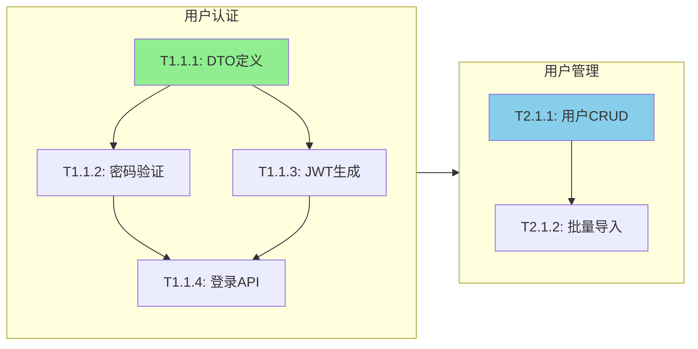

## plan

# Phase 2: 规划工作流（Plan）

> **目标**：计划足够细，执行才够快 | **权限**：只读代码 + 写计划文档

| 操作 | 允许 |
|------|------|
| 读取代码、写五文件持久化（文件位于 workspace，`$STARK_SESSION_DIR`） | Y |
| 修改源代码、运行测试 | - |

---

## 工作流程

### Step 0: 迭代模式目标对齐（仅 iteration_mode == "evaluator-optimizer" 时执行）

> 防止多轮迭代后 PLAN 被局部 Insights 带偏，忘记最终目标。**本步骤是迭代模式的强制门控，不可跳过；不通过 → 不能进入 Step 1。**

```yaml
读取:
  1. "{workspace}/goal.md" 的"目标描述"段（一句话终极目标）
  2. "{workspace}/goal.md" 的最近一轮迭代记录（上轮评分 + 反馈）
  3. "{workspace}/findings.md" 的"策略进化"章节（Insights 方向性建议）

对齐检查（强制三问，每问必须输出明确答案到 plan.md 头部 alignment_log 段）:
  Q1. 本轮 PLAN 服务的目标是什么？
      → 必须从 goal.md 目标描述原文复制（不允许改写或概括）

  Q2. 上轮 Insights 中本轮采纳了哪几条？
      → 列出 insight 编号 + 一句话采纳理由
      → 未采纳任何 insight → 写"无采纳"

  Q3. 采纳的 Insights 与 Q1 目标的关系？
      a. 完全对齐（每条 Insight 都直接服务于 Q1 目标的核心维度）
         → 通过，进入 Step 1
      b. 部分对齐（至少 1 条 Insight 服务于目标的非核心维度，但不冲突）
         → 输出警告 + 在 plan.md 头部追加 "insights_partial_alignment: true"
         → 进入 Step 1
      c. 偏离（采纳的 Insights 与目标描述无直接关联，或推动方向已偏离）
         → 暂停，等用户在两个选项中选择：
            A. 调整 goal.md 目标描述以反映新方向
            B. 丢弃这些 Insights，本轮 PLAN 仅依据 goal.md 原始目标
         → 用户未确认前禁止进入 Step 1

跨轮漂移累计检测:
  - 读取 session.yaml 的 iteration.history
  - 统计连续 N 轮中 "insights_partial_alignment: true" 的轮数
  - 连续 >= 2 轮 → 输出告警:
    "连续 {N} 轮 PLAN 局部对齐，可能在沿 Insights 方向漂移，
     建议人工 review goal.md 是否仍然反映真实目标"
  - 此告警仅提醒，不阻断（否则与 EVALUATE 的 strategy_mode 决策冲突）
```

> `iteration_mode` 字段缺失或为 `"single-pass"` 时跳过此步骤。

### Step 1: 确定实现方案

基于 RESEARCH 阶段的发现选择方案：

```markdown
## 方案选择

| 方案 | 优点 | 缺点 |
|------|------|------|
| A: [方案 A] | [优点] | [缺点] |
| B: [方案 B] | [优点] | [缺点] |

**选择方案**: [方案 X] **原因**: [选择原因]
```

### Step 1.5: 产出 `{workspace}/spec.md`

基于 RESEARCH 发现 + 方案选择结果，写入 `{workspace}/spec.md`：

1. 从 `{workspace}/findings.md` 提取目标和约束
2. 将验收标准写为 GWT 格式（Given-When-Then）
3. 记录变更范围（新增/修改文件 + 不应触及文件）
4. 明确非目标（防止范围蔓延）
5. 将方案选择的 Decisions 从 Step 1 移入 `{workspace}/spec.md` 决策记录表

**Bug Fix 任务**：使用 bugfix-spec-template，填写根因分析和修复方案。

**门控**：`{workspace}/spec.md` 写入后，将目标速览同步到 `{workspace}/plan.md` 的 Spec 段（仅一句话，不重复 AC）。

### Step 2: 三层分解（Epic→Story→Task）

#### 2.1 Scope → Epics（3-7 个独立模块）

```yaml
epics:
  - id: E1
    title: "用户认证模块"
    description: "JWT 登录、刷新、权限验证"
    estimated_loc: 300
    depends_on: []
```

**分解规则**：
- 按业务领域划分，不按技术层划分
- 3-7 个为合适粒度
- 依赖判断：需调用接口或数据 → 依赖；仅需表结构或共享组件 → 不依赖

#### 2.2 Epic → Stories（每 Epic 3-5 个验收单元）

```yaml
stories:
  - id: S1.1
    epic: E1
    title: "实现登录 API"
    acceptance_criteria:
      - "POST /auth/login 返回 JWT"
      - "密码错误返回 401"
    depends_on: []
    parallel_group: "A"
    test_cases_from_ac:
      - ac: "POST /auth/login 返回 JWT"
        test_class: "AuthControllerTest"
        test_methods:
          - "shouldReturnJwtWhenCredentialsValid"
```

#### 2.3 Story → Tasks（每 Story 1-6 个，10-50 LOC 任务）

```yaml
tasks:
  - id: T1.1.1
    story: S1.1
    title: "定义 LoginRequest/LoginResponse DTO"
    file: "src/main/java/com/xxx/dto/AuthDTO.java"
    type: "新增"
    estimated_loc: 20
    depends_on: []
    # 新增（可选）- 用于 work-mode 依赖感知派发
    outputs: ["LoginRequest DTO", "LoginResponse DTO"]  # 本任务产出
    code_skeleton: |
      @Data
      public class LoginRequest {
          @NotBlank private String username;
          @NotBlank private String password;
      }
    verification:
      - "编译通过"

  - id: T1.1.2
    story: S1.1
    title: "实现密码验证逻辑"
    file: "src/main/java/com/xxx/service/AuthService.java"
    type: "修改"
    estimated_loc: 30
    depends_on: [T1.1.1]
    # 新增（可选）- 用于 work-mode 依赖感知派发
    inputs: ["T1.1.1 的 LoginRequest DTO"]              # 依赖的前置产出
    outputs: ["AuthService.authenticate() 方法"]         # 本任务产出
    test_first:
      test_file: "src/test/java/com/xxx/service/AuthServiceTest.java"
      test_cases:
        - name: "shouldAuthenticateWithValidCredentials"
          given: "有效用户名和密码"
          when: "调用 authenticate(username, password)"
          then: "返回 JWT token"
```

**Task 粒度判断**：

| Task 类型 | 估算时间 |
|-----------|---------|
| 定义 DTO（2-3 字段） | 2 min |
| 定义 DTO（5-10 字段） | 3 min |
| 实现简单 CRUD 方法 | 3-4 min |
| 实现带业务逻辑方法 | 4-5 min |
| 编写单个��试用例 | 2-3 min |

**test_first 决策**：引用 `cc-tdd/SKILL.md` 的 test_first 决策表（唯一真实来源）。

#### 2.4 依赖图生成（Mermaid）



### Step 3-4: 保存计划

完成任务规划后，在 workspace（`$STARK_SESSION_DIR`）中创建会话文件：

```
{workspace}/                    ← $STARK_SESSION_DIR（详见 shared-rules/session-workspace.md）
├── spec.md          ← Spec（What/Why，准不可变锚定）
├── plan.md          ← 执行计划 + 状态（How/Status，高可变）
├── session.yaml
├── progress.md
└── findings.md
```

---

## 阶段完成标准

- [ ] 所有任务已细化到 2-5 分钟粒度
- [ ] 每个任务有具体文件路径和代码骨架
- [ ] 每个任务有验证方式
- [ ] 任务依赖关系清晰
- [ ] 每个 Story 的 AC 已映射测试用例
- [ ] 涉及业务逻辑的 Task 包含 test_first
- [ ] `{workspace}/spec.md` 已创建且包含 AC（GWT 格式）
- [ ] 五文件已在 workspace 中创建 + `{workspace}/plan.md` 包含"恢复检查点"
- [ ] **设计文档驱动路径**：plan.md ↔ 改动设计文档一致性自检已通过（见下方 Step 4.5）

---

### Step 4.5: plan ↔ 改动设计文档一致性自检（仅 design-doc-driven 路径）

> **触发条件**：`session.yaml` 中 `research_path == "design-doc-driven"`。标准路径跳过本步骤（DESIGN-REVIEW 子阶段已经覆盖此校验）。
>
> **目的**：设计文档驱动路径在 RESEARCH 阶段已对设计文档做了对抗验证，但 PLAN 阶段产出的任务清单（plan.md）可能脱离改动设计文档的范围或假设。本步骤是 PLAN 阶段对该路径的唯一守门——不做就没有任何机制能发现"plan 跑偏了改动设计文档"。

#### 自检清单

| # | 检查项 | 失败处理 |
|---|--------|---------|
| 1 | plan.md 的 Epic/Story 是否覆盖改动设计文档「变更范围」中所有"新增/修改"项？ | 缺失 → 补任务 |
| 2 | plan.md 的任务文件路径是否与改动设计文档的"变更范围"一致？ | 不一致 → 修正路径或回 RESEARCH 重新对齐 |
| 3 | plan.md 中是否出现改动设计文档「不应触及」清单中的文件？ | 有 → 删除该任务或升级为 DEV-004 |
| 4 | 改动设计文档「实现注意事项」中的对抗验证发现是否在 plan.md 体现（作为风险或显式任务）？ | 未体现 → 补充到风险表或新增任务 |
| 5 | 改动设计文档「Gap 分析」中的"❌ 待创建"实体是否都有对应的新增任务？ | 缺失 → 补任务 |

#### 输出

```
🔍 plan↔设计自检 | 改动设计: {vault_path} | 检查项: 5 | 通过: {N} | 待修正: {M}
```

任一检查失败 → **不能进入 G3**，先修正 plan.md 或回退 RESEARCH。全部通过 → 在 plan.md 头部追加：

```markdown
**design_alignment_checked**: true
**design_doc**: {改动设计文档 vault 路径}
```

EXECUTE 前置检查（workflows-execute-review.md «前置检查» 表）会读取 `design_alignment_checked`，缺失 → 拒绝进入 EXECUTE。

---

### 步骤 5: 冲刺合同协商（Generator-Evaluator Contract Negotiation）

> **触发条件**：任务数 > 8 时必须；≤ 8 时可选（用户主动触发或 Planner 判断复杂度需要）。
> **跳过条件**：用户说"跳过合同" 且 任务数 ≤ 8。
> **设计来源**：[Anthropic Harness Design](https://www.anthropic.com/engineering/harness-design-long-running-apps) — 执行前双方协商防止 reward hacking。

#### 5.1 Generator 提案（Planner 填写）

从 spec.md AC + plan.md 任务列表中提取，填写 spec.md `## 冲刺合同` 的：
- **实现范围表**：每个 Epic/Story 的做什么 + 涉及文件 + 预估 LOC
- **Testable Behaviors 初稿**：每条 AC 转化为可验证的具体行为（类型 + 验证方法 + 阈值），标记 `提出方: Generator`、`状态: 🔴 proposed`

#### 5.2 Evaluator 审查（派发独立 subagent）

```
🤖 general-purpose ← cc-planner.PLAN.Step5 | 任务: 冲刺合同审查
```

派发 `general-purpose` subagent，prompt 见 `prompts.md` 的 `contract-negotiation-reviewer`。

**Evaluator 输入**（推理隔离：不传 RESEARCH findings 和方案选择过程）：
- spec.md 的 `## 冲刺合同` 章节（实现范围 + Testable Behaviors 初稿）
- plan.md 的任务列表（不含 Step 1 的方案比较）

**Evaluator 四维审查**：
1. **可测性** — 每个 TB 能否用命令/脚本得到明确 PASS/FAIL？
2. **完整性** — 是否遗漏关键边界（并发、异常、空值、回滚、权限）？
3. **防作弊** — Generator 能否用最小努力"通过" TB 但实际未解决问题？
4. **阈值合理性** — 阈值是否过松（总能过）或过紧（无法通过）？

**Evaluator 输出**（契约格式见 `shared-rules/data-contracts.md`）：
- `approved_behaviors[]` — 确认通过的 TB 编号
- `challenged_behaviors[]` — 需修订的 TB（含原因 + 建议修订）
- `additional_testable_behaviors[]` — Evaluator 补充的新 TB（含验证方法 + 类型）
- `verdict` — `APPROVE` / `REVISE`（任一 challenged 或 additional 存在时为 REVISE）

#### 5.3 协商迭代

```yaml
协商规则:
  max_rounds: 2          # 最多 2 轮协商（第 1 轮 Evaluator 审查 → 第 2 轮 Generator 修订后 Evaluator 复审）
  auto_accept_additional: true  # Evaluator 补充的 TB 默认接受（Generator 可标记"不可行"但需说明原因）
  
  Evaluator 第一轮输出 REVISE:
    1. Planner 修订 spec.md 冲刺合同（采纳/反驳 challenged，接纳/标记 additional）
    2. 被反驳的 challenged → 在 Negotiation Log 追加 Generator 的反驳理由
    3. 再次派发 Evaluator 复审修订后的合同（第 2 轮）
  
  Evaluator 第二轮仍输出 REVISE:
    → 标记仍有分歧的 TB 为 "⚠️ 待用户裁决"，不再继续协商
  
  Evaluator 输出 APPROVE:
    → 所有 TB 状态标记为 🟢 agreed
    → Negotiation Log 追加 "Status: 🟢 AGREED (R{N})"
```

#### 5.4 用户确认（可跳过）

**自动模式**：用户明确指示"不参与"/"自动执行"/"跳过确认"，或 G3 选择了"自动执行"时：
- Evaluator APPROVE 且无 ⚠️ 项 → 自动打勾确认，直接进入 G3
- 有 ⚠️ 待裁决项 → Planner 自行裁决（采纳 Evaluator 建议），在 Negotiation Log 标注"auto-resolved"
- 输出一行确认日志：`✅ 冲刺合同自动确认（{N} TB agreed，auto-resolved {M}）`

**手动模式**（默认）：协商完成后向用户展示合同摘要：

```
## 冲刺合同已协商完成

**Testable Behaviors**: {N} 项（🟢 agreed: {A}, ⚠️ 待裁决: {B}）
**Evaluator 补充**: {M} 项新增 TB

{冲刺合同 Testable Behaviors 表}

{⚠️ 待裁决项（如有）}

是否同意？
```

- 用户同意 → 冲刺合同 `确认` 段全部打勾，进入 G3
- 用户不同意 → 调整后重新走 5.2
- 用户对 ⚠️ 项裁决 → 更新对应 TB 状态为 🟢 或删除

---

## G3 确认询问（PLAN 完成后，等待用户确认）

PLAN 阶段完成后，向用户展示计划摘要并主动询问执行偏好：

```markdown
## 计划已就绪

**任务概览**: {N} 个任务，预估 {M} 分钟，涉及 {F} 个文件
**复杂度**: {小型/中型/大型}

{plan.md 的任务总览表}

---

**请确认并选择执行方式**：

1. **确认，自动执行** — 我来选择最佳策略（推荐）
2. **确认，用 Ralph 持久模式** — 不完成不停止，自动验证 + 审查
3. **需要调整** — 告诉我哪里要改

> 直接回复 1/2/3 或用自己的话说都行。
```

### 用户回复路由

| 用户回复 | 动作 |
|---------|------|
| "1" / "确认" / "开始" / "可以" | 根据任务规模自动选策略（1/2/3/4） |
| "2" / "ralph" / "持久" / "不停" | 强制策略 4（Ralph 持久模式） |
| "3" / "调整" / 具体修改意见 | 回到 PLAN 修改 |
| 直接说验收标准补充 | 更新 spec.md，然后按 1 处理 |

---

## PLAN → EXECUTE 可选子阶段：DESIGN + DESIGN-REVIEW

> DESIGN 和 DESIGN-REVIEW 是 PLAN 阶段的可选子阶段（仅中型/大型任务触发），不是独立的 RIPER 阶段。RIPER 核心五阶段（RESEARCH→INQUIRE→PLAN→EXECUTE→REVIEW）保持不变。

### 复杂度判断（决定是否需要设计文档）

用户确认 PLAN 后，planner 根据任务清单判断复杂度：

| 条件 | 判断 | 后续 |
|------|------|------|
| **RESEARCH 走了设计文档驱动路径** | 已有改动设计文档 | **跳过 DESIGN + DESIGN-REVIEW，直接 EXECUTE** |
| 任务涉及 3+ 文件 或 跨 2+ 模块 | 中型/大型 | 进入 DESIGN |
| 任务 <= 2 文件 且 单模块 | 小型 | 跳过，直接 EXECUTE |

> **设计文档驱动路径**：当 RESEARCH 阶段已消化外部设计文档并生成改动设计文档（写入 vault）时，DESIGN 和 DESIGN-REVIEW 子阶段不再需要——设计验证已在 RESEARCH 的对抗确认中完成。

判断完成后输出一句话确认：
```
复杂度判断：[大型/中型/小型]（涉及 N 个文件，M 个模块）→ [进入 DESIGN / 跳过直接 EXECUTE]
```

### DESIGN 阶段（用户确认计划后，复杂度中型/大型时触发）

用户确认 PLAN 后，若复杂度为中型/大型，planner 委托 cc-design 生成设计文档：

**触发方式**：
```
🔗 委托: cc-planner → cc-design | 原因: 中型/大型任务需要设计文档
```

**委托开始时更新 `{workspace}/session.yaml`**：
```yaml
delegation:
  active: true
  target_skill: "cc-design"
  delegated_at: "{timestamp}"
  expected_output: "doc/cc-design/[功能名称]_技术设计.md"
```

**传递内容**：
- 完整任务清单（Epic → Story → Task）
- 需求上下文（用户原始需求 + `{workspace}/findings.md` 关键发现）
- 指令：执行 Phase 1-5，完成后返回 planner 控制流（不展示"下一步建议"）

**产出**：
- 一份总体技术设计文档：`doc/cc-design/[功能名称]_技术设计.md`
- design 内部执行 Phase 1-5（复杂度分析、PRD、技术设计、AI 自查、输出验证）

**design 完成后行为**：
- 返回 planner 控制流，不展示 design 自身的"下一步建议"
- planner 记录设计文档路径到 `{workspace}/session.yaml`

**控制流回传验证**（design 完成后 planner 必须执行）：
1. 确认设计文档已生成：`doc/cc-design/[功能名称]_技术设计.md` 存在
2. 更新 `{workspace}/session.yaml`：`design_doc_path` 填写文档路径、`delegation.active` 置为 `false`
3. 进入 DESIGN-REVIEW 阶段（不可跳过）

### DESIGN-REVIEW 阶段（设计评审门控）

设计文档生成完成后，**必须**展示评审提示并停止执行，等待用户反馈。

**评审提示模板**：详见 `../templates.md` design-review-prompt-template 章节

**评审结果处理**：

| 用户选择 | 处理 |
|---------|------|
| ✅ 通过 | 进入 EXECUTE |
| 🔄 需要修改 | 记录修改意见，重新委托 design 生成，重新评审（最多 3 次循环） |
| ❌ 终止 | 结束整个 planner 流程，输出终止报告 |

**对抗验证（DESIGN-REVIEW 内，必须）**：

> 完整协议见 `shared-rules/adversarial-verification.md`

planner 自身评审设计文档后，提取初始评审意见清单（仅结果，不含推理链），派发混合对抗验证 agent：

```
Agent(
  subagent_type="general-purpose",
  max_turns=6,
  description="对抗验证: 设计评审",
  prompt="你是混合对抗验证评审员。

    设计文档路径: {design_doc_path}
    原始需求: {requirement}

    初始评审意见（仅结果，不含推理链）：
    {initial_review_list}

    **Phase A — 定向对抗**（60% 精力）：
    逐条审视上方初始评审意见，对每条问'这个评审意见在什么条件下是错的？'，然后去文档中验证。
    找到反例→记录反驳+证据；找不到→记录确认+检查说明。

    **收尾覆盖补充**（40% 精力）：
    放下初始评审意见，独立评审设计文档，找初始评审完全没覆盖的问题。
    评审维度：完整性（需求覆盖）、可行性（技术方案）、风险（遗漏点）。

    输出格式：
    ## Phase A: 定向对抗
    | # | 初始意见 | 判定 | 证据 |
    |---|---------|------|------|

    ## 收尾覆盖补充
    - [新发现/无额外发现]

    ## 覆盖报告
    - 检查维度: [已检查维度]
    - 读取文件: [已读文件]
    - 未覆盖区域: [如有]"
)
```

验证质量检查：Phase A 覆盖率 ≥70%、有收尾覆盖补充段落、文件读取 ≥2、有覆盖报告。不满足 → 重派 1 次。

综合 planner 自身评审 + 验证 agent 评审（防偏规则见协议 §5），形成综合评审意见后展示给用户：
```
🔍 对抗验证: 设计评审 | 输入: {design_doc_path} | 初始结论: {N}条
🔍 验证完成: 确认 {N} | 反驳 {N} | 盲区 {N} | 未覆盖 {N} | 质量: [充分/不充分]
```

**禁止行为**：
- 评审未通过时禁止进入 EXECUTE
- 不得代替用户做评审决定
- 等待用户回复时禁止自动继续
- 评审循环超过 3 次时，强制暂停并询问用户是否回到 PLAN 重新规划
