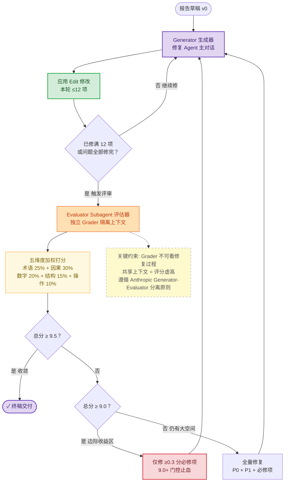
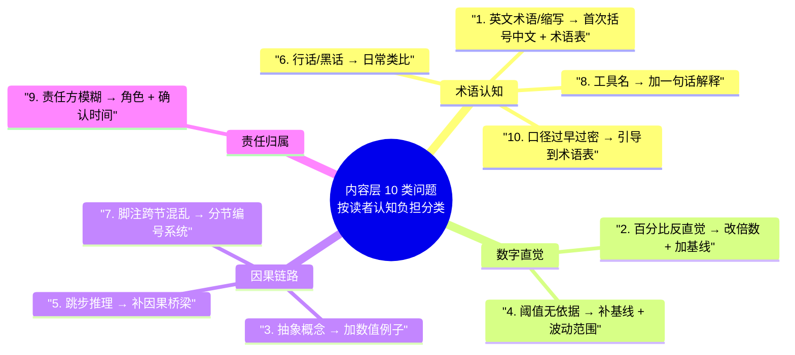

# 报告迭代优化协议 (report-iteration-protocol)

> **目的**：防止报告型 skill 在**多轮迭代修复**中出现两类质量失真 ——
> ① **评分虚高**（修复方与评审方共享上下文导致的自我认可偏差）
> ② **内容过载**（读者无法消化，工作记忆 4±1 溢出，报告虽正确但不可读）
>
> **与 data-report-protocol 的关系**（垂直互补，非从属）：
> - `data-report-protocol` 防**单次生成**的**结构失真**（AP3 瞎编 / AP4 漏报 / aggregation drift 缝合丢失）
> - **本协议** 防**多轮迭代**的**评分偏差** + **最终产出**的**可读性过载**
> - 一个 skill 可以同时遵守两个协议（如 cc-troubleshoot、cc-adversarial），互相不冲突
>
> **理论依据**：
> - Anthropic [Harness design for long-running apps](https://www.anthropic.com/engineering/harness-design-long-running-apps) Generator-Evaluator 分离原则
> - Cowan (2001) 工作记忆 4±1 限制
> - Minto 金字塔原理 + Knaflic 数据叙事
> - Iter 25 用户实战迭代（27 个 skill 并行评审 + 37 处修复，4 轮迭代收敛出 10 类认知负担修复模式）

## 零、意图

数据报告型 skill 在真实使用中经常陷入两类看起来"正确但无效"的状态：

| 失真类型 | 症状 | 根因 |
|---------|------|------|
| **评分虚高** | 修复后评分从 7.5 飙升到 9.2，但实际改动微小 | 修复方（主 agent）同时做评审（自我认可偏差）|
| **无效磨蹭** | 分数从 9.0→9.5 耗时等于 0→9.0，ROI 为负 | 缺少边际收益管理，不知道何时停手 |
| **术语认知过载** | 报告正确但读者读不懂（"weapp"、"SLA"、"RT"）| 没有术语表，首次出现未铺垫 |
| **数字反直觉** | "+167%" 读者无法感知量级 | 未转倍数、无基线参照 |
| **跳步推理** | A→C 断言但证据链断裂 | 工作记忆溢出，省略 A→B→C 中间桥梁 |
| **责任模糊** | "业务方会跟进" 但不知道是谁 | 责任归属未细化到角色+时间 |

本协议针对这两大类（迭代偏差 + 内容过载）分别给出 **Generator-Evaluator 迭代闭环**（§ 二）和 **10 类认知负担修复模式**（§ 三）两条防线。

## 一、适用范围 + opt-in

**推荐遵守**（迭代修复场景 / 最终交付报告给外行读者的 skill）：

- `cc-troubleshoot`（诊断报告迭代优化）
- `cc-adversarial`（对抗验证报告多轮打磨）
- `cc-code-reviewer`（评审报告可读性优化）
- `cc-design`（逆向路径设计文档迭代）
- `cc-eval`（Layer 3 自动修复闭环本身就是 § 二的参考实现场景）

**opt-in 声明**：skill 在 frontmatter 声明：

```yaml
report_iteration_loop: enabled                        # 启用 § 二
report_iteration_max_per_round: 12                    # § 二 每轮修复上限
report_iteration_gate_thresholds: [9.0, 9.5]          # § 二 双门控
report_readability_scan: enabled                      # 启用 § 三
```

**不适用场景**（无需遵守）：
- 单次生成 + 不迭代的 skill（如 cc-cfg / cc-sql / cc-tag 等工具类）
- 内部协议、面向 agent 的结构化输出（无"读者认知负担"问题）

## 二、Generator-Evaluator 迭代修复闭环（防评分虚高 + 边际收益管理）

### 2.1 核心规则

1. **Generator 与 Evaluator 必须在隔离上下文中执行** —— 修复方（主对话 / 主 agent）禁止直接给自己的产出打分，评分必须委托给独立 subagent（盲审模式）
2. **每轮修复项数上限 ≤12** —— 超过 12 项会导致 Edit 行号漂移、旧问题位置与新报告错位、reviewer 无法对齐
3. **9.0 / 9.5 双门控** —— 总分 < 9.0 → 全量修复；9.0 ≤ 总分 < 9.5 → 只修 ≥0.3 分必修项；总分 ≥ 9.5 → 收敛停手
4. **五维度加权打分**（可选默认权重，skill 可按自身场景定义其他维度）：
   - 术语准确性 25%
   - 因果链路完整性 30%（权重最高，因果是报告可信度的硬指标）
   - 数字可解释性 20%
   - 结构清晰度 15%
   - 操作可执行性 10%
   - **注意**：这只是**参考默认权重**，具体 skill 可定义自己的 rubric（如 cc-eval 用 correctness/completeness/actionability/format）

### 2.2 闭环流程图

> **本图展示**：报告生成的迭代修复闭环。**重点关注**：（1）Evaluator Subagent（评估器子代理）是**外部隔离**角色（橙色），不能与 Generator（生成器）共享 context；（2）每轮 ≤12 项的批量容量限制；（3）9.0 / 9.5 双门控的边际收益管理。



| 样式 | 含义 |
|------|------|
| 紫色 | 核心入口 / 终态 |
| 绿色 | 写入动作 |
| 橙色 | 外部隔离上下文（独立 subagent） |
| 黄色 | 只读评估 |
| 红色 | 风险止血操作 |

### 2.3 落地状态

**暂无 skill 完整实现**。`cc-eval` 的 Layer 3 自动修复闭环在**机制上**对齐 § 2.1 #1（Generator-Evaluator 隔离），但参数/维度/门控不对齐：
- cc-eval 使用 **0-1 单阈值**（默认 0.90），非本节 0-10 双门控
- cc-eval 使用**动态 rubric**（`eval/rubrics/domain/*.yaml`），维度由具体 skill 决定
- cc-eval 用 `≤3 个文件` 作为批量约束，粒度和"项"不同

**候选落地方案**：新建 `eval/rubrics/domain/data-report-skills.yaml` 承载五维度 + 双门控作为参考配置，或将本节降级为抽象框架并允许 skill 自定义。待后续架构决策。

## 三、内容层修复模式（防读者认知过载）

### 3.1 意图：防读者认知过载

§ 二 解决"迭代收敛效率"，本节解决**"最终可读性"** —— 即使报告每条 claim 都正确，如果读者要消耗大量认知资源才能理解，报告就是失败的。

**与 CLAUDE.md N8 规则的关系**：CLAUDE.md 中的 N8 规则（首次新概念必须铺垫 + 数据支撑）是**元规则**，本节是 N8 的**落地清单**。

### 3.2 四类认知负担分组

> **本图展示**：10 类高频问题按"目标读者需要克服的认知负担类型"分为 4 大类。**重点关注**：术语认知类占 4/10（最多），印证"术语表是最大单一提分动作"的实战判断。



### 3.3 修复模式对照表（Evaluator 打分依据）

| # | 认知负担类 | 问题类型 | 修复模式 | 示例 | 对应 § 2.1 #4 维度 |
|---|-----------|---------|---------|------|-------------------|
| 1 | 术语认知 | 英文术语 / 缩写 | 首次括号中文 + 术语表 | `weapp` → `weapp（微信小程序）` | 术语 25% |
| 2 | 数字直觉 | 百分比反直觉 | 改倍数 + 加基线 | `+167%` → `增至原来的 2.7 倍` | 数字 20% |
| 3 | 因果链路 | 抽象概念无例子 | 加数值例子 | 混合占比 → `A 班 90 分 10 人、B 班 70 分 10 人` | 数字 20% + 因果 30% |
| 4 | 数字直觉 | 阈值无依据 | 补基线 + 波动范围 | `≥10%` → `≥10%（基线 8.3% + 正常波动 ~2pp）` | 数字 20% |
| 5 | 因果链路 | 跳步推理 | 补因果桥梁 | `A→C` 改成 `A→B→C` | 因果 30% |
| 6 | 术语认知 | 行话 / 黑话 | 日常类比 | 扣款排队 → `类似银行跨行转账排队` | 术语 25% |
| 7 | 因果链路 | 脚注跨节混乱 | 分节编号系统 | 结论区 ¹²³，归因表 ①②③ | 结构 15% |
| 8 | 术语认知 | 工具名裸露 | 加一句话解释 | `Grafana` → `Grafana（数据可视化看板）` | 术语 25% |
| 9 | 责任归属 | 责任方模糊 | 细化到角色 + 确认时间 | `业务` → `业务 Leader（4/7 周会确认）` | 操作 10% |
| 10 | 术语认知 | 口径定义过早过密 | 简化引导到术语表 | 正文一行概括 + `详见术语表` | 结构 15% + 术语 25% |

### 3.4 最大单一提分动作

**术语表从 15→23 条，贡献约 1.5 分提升**（Iter 25 用户实战迭代实测）。

- 边际效率：1.5 / (23-15) ≈ 0.19 分/条
- 判定依据：每多一条术语解释 → 外行读者的工作记忆被占用降一档（Cowan 4±1）
- 下一轮探索：23→30 的 ROI 是否还能维持 0.19 分/条？或进入边际递减区？

### 3.5 落地状态

**暂无 skill 实现**。本节当前作为**规范性清单**供人工 reviewer 或 future Grader 做认知负担扫描使用。下游数据报告型 skill（`cc-troubleshoot` / `cc-adversarial` / `cc-code-reviewer` 等）的 Grader/Reviewer prompt 均未内嵌本节 10 类扫描规则。

**候选落地方案**：
1. 新建 `eval/rubrics/domain/data-report-skills.yaml` 承载 10 类扫描项作为评分维度子项
2. 在各下游 skill 的 Grader prompt 手动嵌入本节规则清单
3. 由 data-report-skills.yaml 统一承载 § 2.1 五维度 + § 3.3 10 类扫描

## 四、skill 引用方式

遵守本协议的 skill 在 frontmatter 声明：

```yaml
---
name: cc-xxx
description: ...
report_generation: true                               # 可选：是否同时遵守 data-report-protocol
report_protocol: data-report-protocol                 # 可选：同时遵守 data-report-protocol
iteration_protocol: report-iteration-protocol         # 声明遵守本协议
report_iteration_loop: enabled                        # § 二: 是否启用迭代闭环
report_iteration_max_per_round: 12                    # § 二: 每轮修复上限
report_iteration_gate_thresholds: [9.0, 9.5]          # § 二: 双门控
report_readability_scan: enabled                      # § 三: 认知负担扫描
---
```

**与 data-report-protocol 的共存**：一个 skill 可以同时声明 `report_protocol: data-report-protocol` 和 `iteration_protocol: report-iteration-protocol`——前者负责结构正确，后者负责迭代收敛 + 可读性。两者不冲突。

## 五、版本历史

| 版本 | 日期 | 变更 | 相关 Iter |
|------|------|------|---------|
| 1.0 | 2026-04-09 | 初始协议：§ 二 Generator-Evaluator 迭代闭环 + § 三 10 类认知负担分类。内容从 data-report-protocol.md Iter 25 v2.0 的 § 九/§ 十 迁移而来（方案 B 分拆） | Iter 26 |
